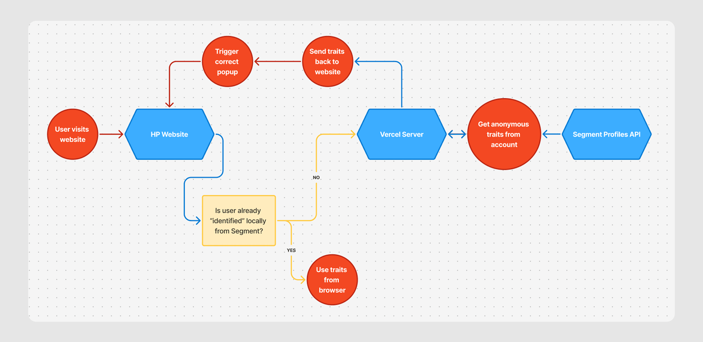
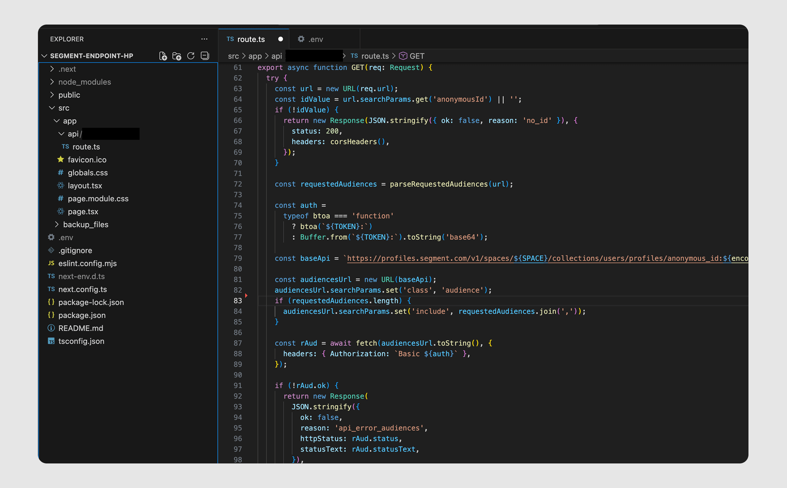

We use Segment as our _Customer Data Platform_ (CDP). It ingests browsing behavior, builds audiences, and forwards them to marketing tools. The system works well - until you need that data *back* in the browser.

This is how I created "glue" for that problem, leveraging the Profiles API and a small proxy.



## The problem

Here's the scenario: our CMO created an `is_affluent` audience based on browsing patterns. She wanted to show premium offers to these users immediately, without waiting for them to identify themselves.

But for anonymous users, Segment data only flows one direction: *into* Segment, not back to the page… (even ConvertFlow's Segment connector can only trigger events for identified users).

So we needed a way to check audience membership for anonymous visitors and trigger things in real-time - specifically, showing a "two luxury gifts + 30% off" offer to affluent shoppers.

With a product launch deadline looming, I built a tiny Next.js proxy endpoint. It sits on Vercel, keeps API credentials server-side, fetches only the traits we request, and returns browser-safe JSON. This is the story of why it exists and how it works.

## Why This Glue Is Necessary

When we first started with Segment, I made a classic mistake: I skim-read the docs (in my defense, they're pretty dull). I saw an `analytics` object in the browser and assumed it had some real-time connection to Segment's computed data.

It doesn't…

The browser analytics object is a local payload that gets updated each time you *send* fresh data to Segment. It's "what data have we just sent" rather than "what's live on this user's profile."

The data we actually wanted - audience membership calculated server-side by Segment - lives behind the Profiles API. You can only query it server-side with authentication, and calling it directly from the browser would expose secrets and still be blocked by CORS.

## What I Built

A Next.js Route Handler (`app/.../route.ts`) that:
- Accepts an `idType` (defaults to `anonymous_id`), an `idValue`, and a list of trait names
- Makes one authenticated request to Segment's Profiles API using `include=` to keep payloads tiny
- Returns a tidy JSON shape for each trait: `value`, `exists`, and a ready-to-use `boolean`



## Runtime and Environment

```typescript
export const runtime = 'nodejs';

const SPACE = process.env.SEGMENT_SPACE_ID!;
const TOKEN = process.env.SEGMENT_PROFILE_TOKEN!;
const ALLOW = process.env.ALLOW_ORIGIN || '*';
```

I force the Node.js runtime to guarantee full Node APIs and predictable behavior. Secrets live in environment variables - easy locally, safer in Vercel, zero risk of leaking to the browser. The `ALLOW` origin lets me tighten CORS per environment.

## Making the Browser Call Safe

Browsers send a preflight OPTIONS check before the real request. I answer it explicitly:

```typescript
function corsHeaders() {
  return {
    'Access-Control-Allow-Origin': ALLOW,
    'Access-Control-Allow-Methods': 'GET,OPTIONS',
    'Access-Control-Allow-Headers': 'Content-Type',
    'content-type': 'application/json',
  };
}

export async function OPTIONS() {
  return new Response(null, { status: 204, headers: corsHeaders() });
}
```

Boring by design - no surprises when a product page makes the request.

## Safe Object Handling

Segment's response shape varies by workspace - sometimes `{ traits: {...} }`, sometimes a bare object. I detect both safely:

```typescript
function isRecord(v: unknown): v is Record<string, unknown> {
  return typeof v === 'object' && v !== null;
}

function hasTraitsKey(v: unknown): v is { traits: unknown } {
  return isRecord(v) && 'traits' in v;
}

function getByPath<T = unknown>(obj: unknown, path: string): T | undefined {
  if (!path) return undefined;
  const keys = path.split('.');
  let acc: unknown = obj;

  for (const key of keys) {
    if (!isRecord(acc)) return undefined;
    if (!Object.prototype.hasOwnProperty.call(acc, key)) return undefined;
    acc = (acc as Record<string, unknown>)[key];
  }
  return acc as T | undefined;
}
```

This walks nested objects safely so `customer.loyaltyTier` or `account.tier` won't crash if something is missing.

## Flexible Query String Parsing

```typescript
function parseRequestedTraits(url: URL): string[] {
  const singles = url.searchParams.getAll('trait').map(s => s.trim()).filter(Boolean);
  const multi = (url.searchParams.get('traits') || '')
    .split(',')
    .map(s => s.trim())
    .filter(Boolean);
  const list = [...singles, ...multi];
  return list.length ? Array.from(new Set(list)) : ['is_affluent'];
}

function toBooleanish(v: unknown) {
  return v === true || v === 'true' || v === 1 || v === '1';
}
```

This accepts `?trait=is_affluent&trait=has_recent_purchase` or `?traits=is_affluent,has_recent_purchase`. If nothing is passed, it defaults to `is_affluent`, which made smoke testing trivial.

## The Core GET Handler

```typescript
export async function GET(req: Request) {
  try {
    const url = new URL(req.url);

    const idType = (url.searchParams.get('idType') || 'anonymous_id').toLowerCase() === 'user_id'
      ? 'user_id'
      : 'anonymous_id';

    const idValue =
      url.searchParams.get('idValue') ||
      url.searchParams.get('anonymousId') || // legacy param
      '';

    if (!idValue) {
      return new Response(JSON.stringify({ ok: false, reason: 'no_id' }), {
        status: 200,
        headers: corsHeaders(),
      });
    }

    const requestedTraits = parseRequestedTraits(url);

    const auth =
      typeof btoa === 'function'
        ? btoa(`${TOKEN}:`)
        : Buffer.from(`${TOKEN}:`).toString('base64');

    const baseApi = `https://profiles.segment.com/v1/spaces/${SPACE}/collections/users/profiles/${idType}:${encodeURIComponent(idValue)}/traits`;

    const u = new URL(baseApi);
    u.searchParams.set('include', requestedTraits.join(','));

    const r = await fetch(u.toString(), {
      headers: { Authorization: `Basic ${auth}` }
    });
```

Two critical decisions here:
- `include=` requests only the fields we care about, keeping responses small and fast
- Auth lives server-side and is added just-in-time - the Profiles API token never touches the browser

## Handling 404s and API Errors

```typescript
    if (r.status === 404) {
      const results: Record<string, { value: unknown; exists: boolean; boolean: boolean }> = {};
      for (const t of requestedTraits)
        results[t] = { value: null, exists: false, boolean: false };
      
      return new Response(
        JSON.stringify({
          ok: true,
          reason: 'not_found',
          idType,
          idValue,
          traitsRequested: requestedTraits,
          results,
        }),
        {
          status: 200,
          headers: { ...corsHeaders(), 'Cache-Control': 'public, max-age=120' }
        }
      );
    }

    if (!r.ok) {
      const body = await r.text().catch(() => '');
      return new Response(
        JSON.stringify({
          ok: false,
          reason: 'api_error',
          httpStatus: r.status,
          statusText: r.statusText,
          body: body.slice(0, 400),
        }),
        { status: 200, headers: { ...corsHeaders(), 'Cache-Control': 'no-store' } }
      );
    }
```

If Segment has no profile yet, I return a calm success (`ok: true`, `reason: 'not_found'`) with 120-second caching. If there's an API error, I surface a compact error object marked `no-store` so we don't cache mistakes.

## Shaping the Response

```typescript
    const raw: unknown = await r.json();

    const traits: Record<string, unknown> =
      hasTraitsKey(raw) && isRecord(raw.traits)
        ? (raw.traits as Record<string, unknown>)
        : (isRecord(raw) ? (raw as Record<string, unknown>) : {});

    const results: Record<string, { value: unknown; exists: boolean; boolean: boolean }> = {};
    for (const t of requestedTraits) {
      const value = getByPath(traits, t);
      const exists = value !== undefined && value !== null;
      const boolean = toBooleanish(value);
      results[t] = { value, exists, boolean };
    }

    return new Response(
      JSON.stringify({
        ok: true,
        idType,
        idValue,
        traitsRequested: requestedTraits,
        results,
      }),
      {
        status: 200,
        headers: {
          ...corsHeaders(),
          'Cache-Control': 'public, s-maxage=300, stale-while-revalidate=300',
        },
      }
    );
  } catch {
    return new Response(
      JSON.stringify({ ok: false, reason: 'error' }),
      { status: 200, headers: { ...corsHeaders(), 'Cache-Control': 'no-store' } }
    );
  }
}
```

Three fields per trait:
- `value`  -  the raw trait value
- `exists`  -  present vs missing; helpful for deciding whether to retry or fall back
- `boolean`  -  ready for instant UI branching

I set shared cache headers so the happy path stays snappy under load.

## How the Page Uses It

For our launch, the product page did something like:

```typescript
const url = new URL('/api/traits', location.origin);
url.searchParams.set('idType', 'anonymous_id');
url.searchParams.set('idValue', window.analytics?.user().anonymousId());
url.searchParams.set('traits', 'is_affluent');

const res = await fetch(url.toString(), { method: 'GET', credentials: 'omit' });
const data = await res.json();

if (data.ok && data.results?.is_affluent?.boolean) {
  showPremiumOffer(); // 2 luxury gifts + 30% off
} else {
  showGentleNudge(); // Sample kit or free-shipping progress bar
}
```

Simple rule: check the boolean, act, move on. No extra parsing, no fragile cross-site calls.

## Why Next.js on Vercel for a Non-React Task?

**Route Handlers**: One file, first-class GET/OPTIONS support, web-standard Request/Response. Easy to reason about and test.

**Runtime control**: `export const runtime = 'nodejs'` gives you the full Node surface when you need it.

**Deploy & scale**: Vercel Functions handle traffic bursts when a campaign goes live. I didn't manage servers; I shipped code.

Is it odd to use Next.js with zero React? A little. But as a packaging format for server endpoints, it's excellent.

## Trade-offs I Made

**Always 200 with an `ok` flag.** The browser has one parsing path - handle state, not transport drama.

**Short negative caching (120s)** smooths the early minutes when brand-new visitors' traits haven't settled.

**Configurable origins.** Started permissive for QA across preview domains, then locked down to live storefronts.

**Legacy param support** kept older code working during rollout.

**Default `is_affluent`** kept smoke tests simple and matched the launch goal.

## What This Achieved

**Premium offer at the right time.** If `is_affluent` was true, we showed the luxury bundle straight away.

**Margin protection.** For that cohort, we suppressed generic discounts that weren't needed to convert.

**Gentle alternatives.** If the trait was missing or false, we nudged towards a sample kit or free-shipping progress - helpful, not pushy.

The effect was practical: higher first-order value for the right shoppers, and a calmer experience for everyone else.

## What I Learned

I'm not a CDP specialist. This was a fast education in how Segment's browser library differs from its Profiles API, and why a tiny server proxy is often the right answer. The pattern is simple: hide upstream complexity, expose only what the page needs, keep secrets server-side.

Marketing got the personalization moment they wanted. The site stayed lean. Segment remained the source of truth. Sometimes the best infrastructure is just careful glue under pressure.