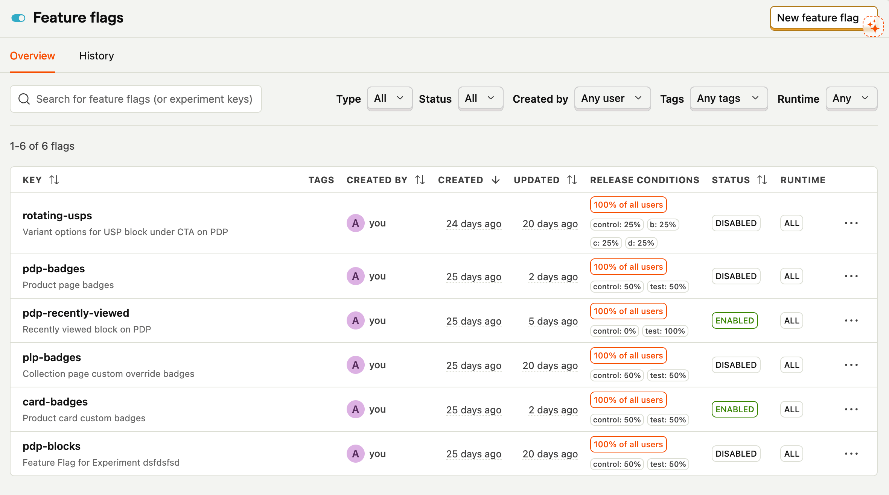
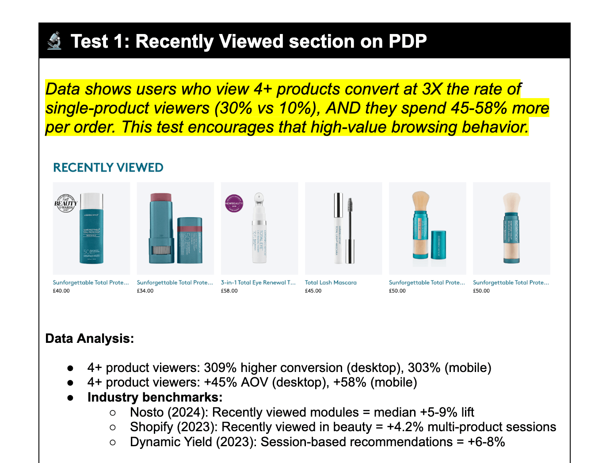

In practice, there's two kinds of outta-da-box A/B tests on Shopify, and neither one does exactly what you want…

The first kind are *visual tools* - AB Tasty, VWO, Optimizely. These are so expensive, they will bankrupt your business. They manipulate the DOM after page load - resulting in flicker.

The second are newer *Shopify-native apps* like Shoplift or Elevate. These solve the flicker problem by duplicating theme templates instead of injecting DOM changes. But they're built around whole-template swaps - no granularity possible.


Neither of these did what I needed. So I built a third option, using <mark>PostHog's feature flags</mark>. This article is about how they work, and why you want them.

---

## Why PostHog

Feature flags are everywhere in SaaS. I used them constantly working as a React dev on helpdesk software - they're how you roll out changes incrementally, segment users, run internal tests.

Basically, a single line of JS that says "on" or "off" in the browser. You handle all logic beyond that.

It never occurred to me to use them for eCommerce A/B testing until I started hitting the limitations of Shopify's testing apps. But once the idea clicked, it made everything else fall into place.



A feature flag doesn't care what kind of site it's on. It just assigns users to variants server-side, and now your features have an "on/off" switch.

Aside from the fact it's <mark>basically free</mark>, PostHog was an obvious choice because it has great metric setup. You define primary and secondary metrics per experiment. That distinction is really important - more later.

---

## A Real Test: The "Recently Viewed" Section

I wanted to test whether adding a "Recently Viewed" section to PDPs would improve conversion - the idea being that if a customer lands on a product that isn't quite right, showing them products they've already looked at gives them a low-friction path back into the catalogue.



I set up the experiment with CVR (add-to-cart rate) as my primary metric and PDP views per session as secondary. 50/50 split.

The results were genuinely surprising: a marginal +4% lift in CVR, but a <mark>-0.5% drop in PDP views</mark>. The section *wasn't* driving more browsing. If anything, it was short-circuiting it - someone who's already scrolled to the bottom of a PDP is engaged with that product, not looking for an escape route.

So I repositioned it. Instead of sitting on PDPs, the recently viewed section moved to collection pages - where users are actively scanning and comparing. The result was an <mark>+18% increase in PDP views per session</mark>. Same feature, completely different signal, just placed where it could actually do its job.

---

## The Code Setup

The principle is simple: **the theme controls the variants, PostHog controls the flags, and JavaScript is the thin layer connecting the two.**

Variant elements live in the Liquid templates, hidden by default via CSS until JavaScript confirms the user should see them. There's also a theme-setting override (`turn_on_all_ab_tests`) that forces every variant on regardless of PostHog - handy for building and QA.

```liquid
  <!-- a LIQUID file -->
  <script>
    window.areAllABTestsOn = {{ settings.turn_on_all_ab_tests | json }};
  </script>
  <style>
    /* Hide all B variants by default - zero layout shift for control */
    [data-abtest] [data-abtest-var="b"], [data-abtest-var="b"] {
      display: none;
    }

    /* Badge tests: hide by default, but only badges marked as "testable" */
    .badge-component-ab-controls.testable {
      display: none;
    }
    /* Selectively reveal based on body attributes set by JS */
    body[data-abtest-plp-badges] .badge-component-ab-controls.plp-badges.testable {
      display: inline-block;
    }
    body[data-abtest-card-badges] .badge-component-ab-controls.card-badges.testable {
      display: inline-block;
    }
    body[data-abtest-pdp-badges] .badge-component-ab-controls.pdp-badges.testable {
      display: inline-block;
    }

    /* Multi-variant tests: hide the container and all variants until JS picks one */
    [data-abtest="rotating-usps"] {
      display: none;
    }
    [data-abtest="rotating-usps"] [data-abtest-var] {
      display: none;
    }
  </style>
```

The JavaScript side runs once inside PostHog's `onFeatureFlags` callback. Two patterns: simple CSS toggles use a body attribute; multi-variant tests call a handler. Every handler bails out early if its target element doesn't exist, so the whole thing fails safely - no errors on pages where a test isn't relevant.

```javascript
posthog.onFeatureFlags(function() {
  const areAllABTestsOn = window.areAllABTestsOn;

  // Pattern A: CSS-only toggles - set a body attribute, let the stylesheet do the rest
  if (posthog.getFeatureFlag('card-badges') === 'test' || areAllABTestsOn)
    document.body.setAttribute('data-abtest-card-badges', true);
  if (posthog.getFeatureFlag('plp-badges') === 'test' || areAllABTestsOn)
    document.body.setAttribute('data-abtest-plp-badges', true);

  // Pattern B: multi-variant tests - need a handler to pick the right variant
  if (posthog.isFeatureEnabled('rotating-usps') || areAllABTestsOn) {
    const variant = areAllABTestsOn ? 'b' : posthog.getFeatureFlag('rotating-usps');
    handleRotatingUSPsTest(variant);
  }
})

// Every handler follows the same defensive pattern: bail out at each step if nothing's there
function handleRotatingUSPsTest(variant) {
  if (!variant) return;

  const test = document.querySelector('[data-abtest="rotating-usps"]');
  if (!test) return;

  const testElement = test.querySelector(`[data-abtest-var="${variant}"]`);
  if (!testElement) return;

  // Only if we've confirmed everything exists: reveal
  test.style.display = "block";
  testElement.style.display = "block";
}
```

The `testable` class is worth highlighting as an example of how this stays granular at the component level. Badges render across the whole site, but only the ones explicitly opted into a test get the class - and only those get hidden/revealed by the test infrastructure:

```liquid

  {# Collection-level badge - part of the PLP badge test #}
  
  


  {# Product-level badges - part of the card badge test #}
  
    
      
      
    
  

```

The tradeoff is that every variant needs to be built into the theme before a test can run (what might be called a *vertical slice*).

But… the benefit is your control/test variants run on the same code (no performance differences), and rolling things out is extremely simple (because you built it properly first time)!

---

## What This Gets You

A testing setup that's part of the theme, not bolted on top of it. Variant assignments that don't flicker. Metrics that are easy to define and easy to read. And a codebase where every test is visible, auditable, and removable - no black-box scripts to untangle when an experiment ends.

If you're running A/B tests on a Shopify store and relying on an app from the App Store to do it, it's worth asking whether the data you're getting is actually trustworthy. More often than not, it isn't - and the fix is simpler than you'd expect.