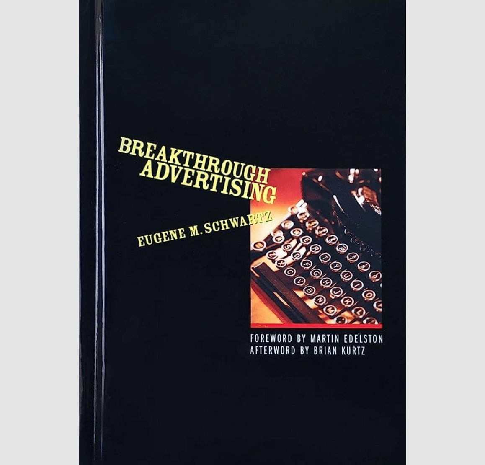
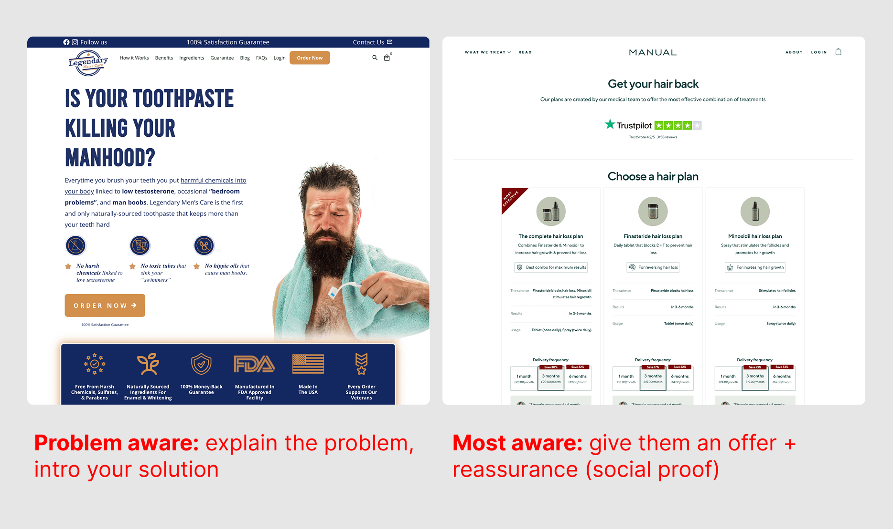
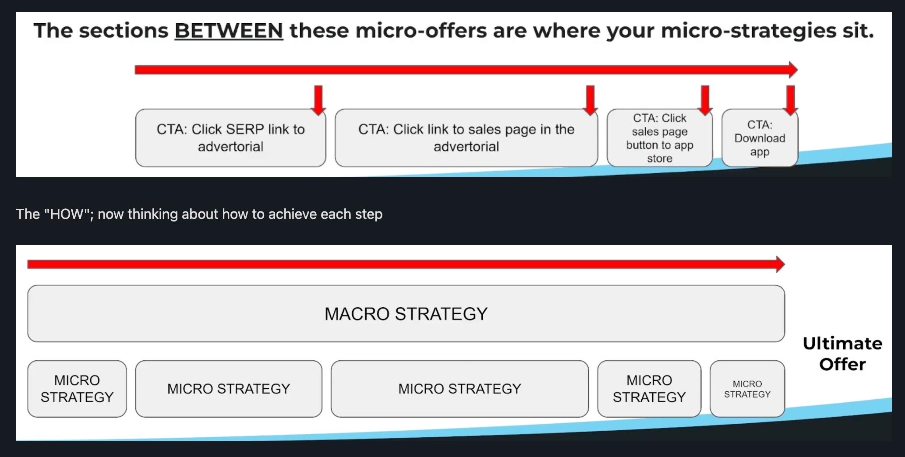
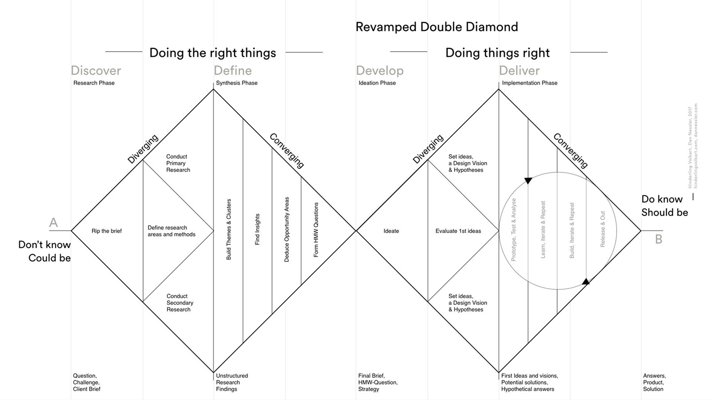
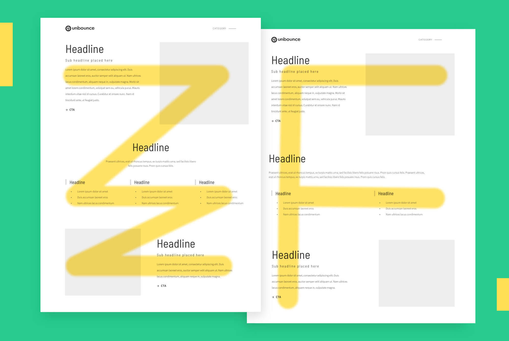

I'm a developer who got tired of building UIs that never converted, so I <mark>decided to change things</mark>.

About 2 years into my career, I worked on a web project for *American Golf*. The bosses were happy with how the new pages looked. But on launch, the needle barely moved - no extra conversions…

That's when I first learned there's a huge difference between knowing how to build and knowing what to build. So I went down the rabbit hole on conversion psychology, persuasion, UX, and marketing funnels.

How deep did I go? *(Spoiler: pretty deep!)*

Now, this topic is huge, and most blog posts only focus on a narrow slice of the pie (UX tactics, copy formulas)…

So in this guide, I'm going to break the whole thing down by the resources I learned from directly - probably easier and more useful.

<mark>Warning:</mark> my takes in [6. Conversion Design (UX)](#6-conversion-design-ux) might be controversial, so if you're an *"eCommerce UX designer"* - look away now.

***

## **1. Customer Awareness**

Before you can optimise something, you need to understand where your visitor is in their journey. Eugene Schwartz's _Breakthrough Advertising_ breaks this down into five stages of awareness, and it's the single most useful framework for structuring conversion-focused pages.

### The 5 Stages of Customer Awareness:

1. <mark>Unaware</mark> - Don't know they have a problem
2. <mark>Problem Aware</mark> - Know they have a problem, don't know solutions exist
3. <mark>Solution Aware</mark> - Know solutions exist, don't know about your product
4. <mark>Product Aware</mark> - Know about your product, not convinced it's right for them
5. <mark>Most Aware</mark> - Ready to buy, just need the right offer/push

### Why this matters for CRO:

The awareness stage dictates everything about how you structure a page. An unaware visitor needs education and problem agitation. A most-aware visitor just needs reassurance and a clear path to purchase.

When I audit landing pages or product pages, this is the first question I ask: _Who is this page for?_ A homepage might serve multiple awareness stages (which is why they're complex), but a landing page should target ONE specific stage. When you try to speak to everyone, you speak to no one.

### How this changes the content:

- **Unaware/Problem Aware**: Long-form content, education-heavy, problem-focused headlines, stories and scenarios
- **Solution Aware**: Comparison-focused, "Why us?" positioning, feature differentiation
- **Product Aware**: Benefits, proof, objection handling, detailed specifications
- **Most Aware**: Minimal friction, clear CTA, urgency, simple reassurance

This is how awareness impacts testing strategy too. If you're testing headlines on a page targeting solution-aware traffic, you're testing differentiation angles. If you're testing for most-aware traffic, you're testing friction reduction and urgency.

***

## **2. What Drives Human Decisions**

Once you know where someone is in their awareness journey, you need to understand what actually motivates them. This is where conversion psychology gets practical.

### Life Force 8 + Secondary Wants

Drew Eric Whitman's _Cashvertising_ breaks down human motivation into the "Life Force 8" - biological, hardwired desires that drive decisions:

1. Survival, <mark>enjoyment of life</mark>, life extension
2. Enjoyment of <mark>food</mark> and beverages
3. Freedom from fear, <mark>pain</mark>, and danger
4. <mark>Sexual</mark> companionship
5. Comfortable <mark>living conditions</mark>
6. To be superior, <mark>winning</mark>, keeping up with the Joneses
7. Care and <mark>protection</mark> of loved ones
8. <mark>Social approval</mark>

There are also 9 "Secondary" learned wants (things we're conditioned to want): to be informed, curiosity, cleanliness, efficiency… etc. But these are less emotional/powerful drivers.

#### How I use this:

When auditing a landing page, I look for whether the messaging taps into something people _actually_ care about. Is the hero section talking about product features, or is it connecting to a Life Force desire?

Example: A premium skincare brand shouldn't lead with "Contains peptides and hyaluronic acid" (features). They should lead with "Look 10 years younger" (Life Force 1: life extension) or "Feel confident in your skin" (Life Force 8: social approval).

### The NESB Framework

If you don’t know him, Kyle Milligan is a big deal finance copywriter (imagine: extremely long landing pages with tons of emotion and social proof with a few Lamborghini shots thrown in).

But I’ve found his framework works in basically any industry: only four emotions drive sales - **New, Easy, Safe, Big**.

This is incredibly useful when a client doesn't have a clear differentiator or when you're trying to reframe an existing offer.

- <mark>New</mark> is the most powerful because novelty triggers dopamine. It promises that this solution can work even if they've tried similar things before. "New" doesn't have to mean literally new - it can mean a new approach, new perspective, new combination.
- <mark>Easy</mark> removes effort. "5-minute setup," "no technical knowledge required," "done-for-you."
- <mark>Safe</mark> addresses risk. Money-back guarantees, social proof, authority markers, "no credit card required."
- <mark>Big</mark> is about the scale of the outcome. "10X your results," "industry-leading," "the complete solution." (Notice how I added “8+ years” to the title of this article?)

When I'm explaining conversion strategy to clients who don't have strong product differentiation, this is the framework I use. We map out: which of these four angles can we credibly own? Then we build messaging and page structure around that.

### **Cialdini's 7 Principles of Influence**

Robert Cialdini's principles are the universal psychological triggers that work across all contexts:

1. <mark>Reciprocity</mark> - Give value first (free samples, guides, tools)
2. <mark>Commitment</mark> - Small commitments lead to bigger ones (progressive profiling, multi-step forms)
3. <mark>Social Proof</mark> - Others are doing it (reviews, testimonials, "X people bought this")
4. <mark>Authority</mark> - Expert endorsement (certifications, press mentions, credentials)
5. <mark>Liking</mark> - People buy from those they like (brand personality, relatability, shared values)
6. <mark>Scarcity</mark> - Limited availability (stock counts, time-sensitive offers)
7. <mark>Unity</mark> - Shared identity ("made for people like you")

These aren't tactics to sprinkle randomly across a page - they're strategic levers. When you understand _why_ they work, you can deploy them intentionally.

Example: Social proof works because of information cascade and risk reduction. So placing "2,847 five-star reviews" near an Add to Cart button isn't just decoration - it's directly addressing purchase anxiety at the moment of decision.

***

## **3. What Are Offers?**

Here's where things get confusing, especially if you're coming from an eCommerce background. An "offer" isn’t just the "the product" or "the price." It means the complete value exchange you're proposing.

### Defining "Offer" in Different Contexts:

<mark>eCommerce:</mark> Your offer is the product + price + shipping + guarantees + bonuses + urgency. When someone adds a product to cart, they're not just buying the item - they're buying the complete package. Free shipping changes the offer. A 30-day return policy changes the offer. A limited-time discount changes the offer.

This is why two identical products at the same price can have wildly different conversion rates. The _offer_ is different.

<mark>Info Products/Services:</mark> The offer is the transformation + proof + risk reversal + pricing structure. You're not selling a course or a service - you're selling the outcome. "Learn Facebook Ads" is not an offer. "Go from zero to your first profitable campaign in 30 days, or your money back" is an offer.

<mark>Lead Generation:</mark> The offer is what you're asking for vs. what you're giving. "Subscribe to our newsletter" is a weak offer. "Get the 2024 Conversion Optimisation Playbook (37 pages, used by 10,000+ marketers)" is a strong offer. You're still asking for an email address, but the perceived value exchange is completely different.

### Why This Distinction Matters for CRO:

When conversion rates are low, people often blame the traffic, the design, or the product. But usually, the problem is the offer. Either:

1. The offer isn't clear (people don't understand what they're getting)
2. The offer isn't compelling (the value exchange feels unbalanced)
3. The offer isn't credible (they don't believe you'll deliver)

Understanding this lets you diagnose conversion problems more accurately. If you're testing button colors on a landing page with a weak offer, you're rearranging deck chairs. Fix the offer first, then optimise around it.

### A Brief Note on "Irresistible Offers"

Although I won't go into full detail, Mark Joyner's book *Irresistible Offers* is a great starting point if you want to learn more. But it can also confuse the topic by throwing multiple frameworks at you (something this article is probably already guilty of).

I'll quickly break it down here, to give you an idea.

**The 4 questions every buyer asks:**

- Q1: What are you selling me? (Clarity beats cleverness, don't hide your offer)
- Q2: How much? (Price uncertainty creates anxiety)
- Q3: Why should I believe you? (Real proof: testimonials, case studies, certifications)
- Q4: What's in it for me? (Outcomes, not features or plain benefits. People don't buy products - they buy better versions of their lives)

**The 3 elements of an Irresistible Offer:**

1. Touchstone (3 seconds) - your hook - the immediate attention-grabber that makes someone stop scrolling. It's usually your headline and hero image.
2. Believability - your social proof (placed after the touchstone to back up any wild claims)
3. High ROI Offer - present the complete value exchange as clearly as possible (and make sure it's valuable)

Again, a lot of these are retreads of existing ideas on this page, but it's a book I'd highly recommend if you have time.

***

## 4. Marketing Strategy In 3 Steps

Here's where we zoom out from individual offers to overall conversion strategy. Most "marketing strategy" resources make this seem more complicated than it is - usually because complexity sells consulting services.

The CopyThat channel on YouTube once ran a *Marketing Strategy Fundamentals* course - it was the best intro to the subject ever (I know the creators IRL so I might be a little biased).

### What Marketing Strategy Isn't

It's not multi-pronged colorful charts with 17 touchpoints and vague arrows. It's not something that takes a 40-slide deck to explain. Those charts exist to make simple concepts seem sophisticated.

Real marketing strategy is about understanding the path from prospect to customer and optimising each step.

### The Only 3 Steps That Matter

Every buyer journey, regardless of industry or business model, has three core steps:

1. <mark>Prospect sees offer</mark> - Goal: Get the offer in front of the right people. This is traffic, distribution, advertising - getting attention.

2. <mark>Prospect likes offer</mark> - Goal: Make the offer appealing. This is messaging, positioning, value proposition - creating desire.

3. <mark>Prospect accepts offer</mark> - Goal: Remove friction from acquisition. This is UX, checkout optimisation, form design - making conversion easy.

That's it. Everything else is a variation or subset of these three steps.

When conversion rates are low, you can diagnose which step is failing:

- Low traffic, high conversion = Step 1 problem (distribution)
- High traffic, low conversion = Step 2 or 3 problem (offer or friction)
- High add-to-carts, low checkouts = Step 3 problem (friction)

### Macro Strategy vs. Micro Strategy

<mark>Macro strategy</mark> is your long-term plan with one key metric you're optimising for. For eCommerce, that's usually revenue or profit. For SaaS, it's usually MRR or activation rate. For lead gen, it's usually qualified leads or pipeline value.

<mark>Micro strategy</mark> is the space between micro-offers and micro-conversions that lead toward the main conversion. This is where CRO lives.

**The key question for micro strategy:** "What's stopping the prospect from accepting the main offer right now?"

Maybe they don't understand the product (needs education). Maybe they don't trust you (needs social proof). Maybe the price feels risky (needs guarantee or trial). Each of these barriers requires a micro-conversion: watching a demo video, reading reviews, seeing the return policy.

This is how I prioritize CRO tests. I map out the macro conversion goal, identify the biggest drop-off points, then ask: what information or reassurance is missing at this step?

### High-Ticket vs. Impulse Purchases

One of the biggest mistakes I see (and have been guilty of myself) is treating all products the same way. A £15 picture frame and a £1,500 course require completely different conversion strategies.

Story time: I read a Reddit thread once about a marketer who tried to sell house paint with a lead funnel… (“10X House Painting - The Ultimate PDF Guide!”).

As you can imagine, putting this much effort into selling a £15 tin of paint was extremely counterproductive and just didn’t work. People either need paint, or they don’t…

Here’s why:

<mark>Impulse purchases</mark> (low cost, low risk):

- Minimal content needed
- Visual appeal matters more
- Decision is often emotional/aesthetic
- One-step checkout works fine
- Social proof is nice but less critical

<mark>High-ticket purchases</mark> (high cost, high risk):

- Substantial proof required
- Education and knowledge-building necessary
- Multiple touchpoints before conversion
- Authority and expertise markers essential
- Detailed objection handling needed

Over-explaining a simple impulse buy creates unnecessary friction. Under-explaining a big purchase creates unnecessary anxiety. Know what you're selling and match the strategy to the price point and risk level.

***

## 5. The LIFT Model

This is the framework I use on every single CRO project. It was developed by WiderFunnel (now part of Conversion.com) and it's the most practical, comprehensive model I've found for diagnosing conversion issues.

LIFT stands for *six conversion factors*, and the model treats your Value Proposition as the sum of all these elements.

- <mark>Value Prosition</mark>
- <mark>Relevance</mark> 
- <mark>Clarity</mark>
- <mark>Anxiety</mark>
- <mark>Distraction</mark>
- <mark>Urgency</mark>

### 1. Value Proposition

The perceived benefit of your offer. What's the complete value exchange you're proposing? This is the foundation - if the underlying offer isn't valuable, no amount of optimisation will fix it.

### 2. Relevance 

Does the content match what people expected to see? If someone clicks an ad about "organic dog food" and lands on a page about pet accessories, relevance is broken. Does your value proposition match their needs and search intent?

This also applies to <mark>message match</mark> between ad copy and landing page copy. If your ad promises "free shipping" but the landing page doesn't mention it, you've lost relevance.

### 3. Clarity

Is your value proposition obvious? Can someone understand what you're offering within 3-5 seconds? Clarity issues often come from:

- Vague headlines ("Transform Your Business")
- Unclear CTAs ("Learn More" vs. "Start Free Trial")
- Buried key information
- Jargon or insider language

I see clarity problems constantly in SaaS and B2B. Companies assume people understand their product category or what they do. They don't, so be a little obvious.

### 4. Anxiety

Do elements on the page create uncertainty or doubt? Common anxiety triggers:

- No <mark>trust signals</mark> (SSL, security badges)
- No social proof
- Asking for too much information upfront
- Unclear pricing or hidden costs
- No return policy or guarantee
- Unfamiliar brand with no credibility markers

Anxiety increases with price and commitment level. A £20 purchase requires minimal anxiety reduction. A £2,000 purchase requires substantial reassurance.

### 5. Distraction

What's the first thing people see when they land on the page? Does it help or hurt conversion? Distractions pull attention away from your primary conversion goal:

- Multiple competing CTAs
- Irrelevant images or content
- Navigation that offers too many exit points
- Pop-ups at the wrong time
- Auto-playing videos

The concept of "1\:1 attention ratio" ties in here (next section): ideally, the number of actions someone can take matches the number of actions they should take. Landing pages should have one clear path. Homepages can have more, but each section should still have focus.

### 6. Urgency

Why should someone take action now versus later? Urgency can come from:

- Time-limited offers or discounts
- Stock scarcity ("Only 3 left")
- Cohort/enrollment deadlines
- Seasonal relevance
- Problem agitation (cost of inaction)

Urgency is often overused or used dishonestly (fake countdown timers, false scarcity). When it's genuine and relevant, it works. When it's not, it damages trust.

### How I Apply LIFT in Practice

When I audit a page, I score it on each of these six factors. Then I prioritize improvements based on:

1. Which factors are weakest
2. Which factors will have the biggest impact for this specific offer
3. What's feasible to test given technical and resource constraints

For example, if I'm auditing a product page with strong reviews (low anxiety) but a confusing value prop (low clarity), I know where to focus. Or if a landing page has clear messaging but no urgency and lots of distractions, those become the testing priorities.

The LIFT model also helps me communicate with stakeholders. Instead of arguing about subjective design preferences, we can discuss objective conversion factors: "This design increases distraction" or "This change improves clarity."

## 6. Conversion Design (UX)

This is something I feel qualified to give my honest opinion on…

<mark>For 90% of businesses, UX design is irrelevant</mark> - or at least - handled very, very poorly. This is in part because most UX training is rigidly methodical (*‘Double Diamond Process’*, *‘Design Thinking’*, *‘Atomic Design’*…etc).

A junior UX person gets into the industry, learns about “cognitive load” / "mental models” (i.e. understand what customers expect and design accordingly so you don't freak them out)…

…and they'll drag a simple eComm store through a laborious full-UX process, with user interviews, convergent/divergent thinking, ethnographic studies, user personas……*blah, blah, blah*

**This isn't just expensive time-wise, it's also semi-useless:**

When you’re designing a complex SaaS tool, you need lots of guardrails and user data. But when you’re building an eCommerce site, the “mental models” are <mark>already deeply understood</mark>. People know what shopping online looks/feels like already.

Most websites just need a few data-backed, conversion-focused improvements, **not** a complete reimagining of what it "means" to shop.

That's why, I'm going to skip the *‘Double Diamond Process’*, and instead recommend…

Unbounce's *"7 Principles of Conversion-Centered Design"*. A particularly solid and accessible overview of how UX concepts actually apply to conversion optimisation:

### 1. Create Focus

Analysis paralysis is real. When faced with too many choices, people often choose nothing. In UX terms, this is "cognitive load" - the mental effort required to process information and make decisions.

The goal is to achieve a <mark>1\:1 attention ratio</mark>: the number of things you can do should match the number of things you should do.

**How this applies:**

- Landing pages should have ONE primary CTA and ONE conversion goal
- Product pages should guide toward ONE action (add to cart), with secondary actions (wishlists, sharing) visually de-emphasized
- Homepages are an exception because they serve multiple awareness stages and user types, but even then, each section should have focus

When I audit pages with low conversion rates, excess choice is often the culprit. Multiple CTAs competing for attention, unclear hierarchy, or too many exit points.

### 2. Build a Structure

<mark>Information hierarchy</mark> determines how people process and understand your page. The order of information should be logical and follow a narrative that moves people toward conversion.

This connects directly to awareness stages ([Section 1](#1-customer-awareness)) and offer anatomy ([Section 4](#3-what-are-offers)). Your structure should match where people are in their journey and answer their questions in sequence.

**Typical high-converting structure:**

- Hero: What this is + who it's for (Touchstone)
- Benefits/Features: Why this matters
- Social Proof: Why you should believe us (Believability)
- Objection Handling: Address concerns
- Offer: Complete value exchange (High ROI)
- CTA: Clear next step

This isn't a rigid formula - adjust based on your product, audience, and awareness stage. But the principle holds: information should flow logically, building confidence and desire as people scroll.

### 3. Stay Consistent

Every touchpoint with your brand should feel cohesive. This isn't just about brand aesthetics - it's about maintaining the message match and relevance (from the LIFT model).

If someone clicks an ad, lands on your page, and the messaging feels disconnected, they'll bounce. If your landing page looks completely different from your website, trust drops.

**Consistency applies to:**

- Visual branding (colors, typography, imagery style)
- Messaging and tone
- Promise in ads vs. delivery on page
- Value proposition across touchpoints

I've seen conversion rates drop significantly when ad copy promises one thing and the landing page delivers another - even if both are good individually. The disconnect creates friction.

### 4. Show Benefits

This connects to the Life Force 8 concept from [Section 2](#2-what-drives-human-decisions). People don't buy features - they buy <mark>outcomes</mark> and transformations.

But here's the key: **visual proof lets the brain infer its own benefits**. You can keep copy tight and focused without exhaustively listing results, if you show rather than tell.

Example: A before/after image of a renovated room communicates transformation more powerfully than a paragraph describing the renovation service. A screenshot of a dashboard showing clear metrics works better than explaining "you'll get actionable insights."

This is especially powerful in eCommerce. Show the product in use, in context, solving the problem. Let people imagine themselves with it.

### 5. Draw Attention

Not all page elements are equally important. Your design should direct attention to what matters most using:

**Color psychology** (sort of): The specific color of your CTA button matters less than people think. What actually <mark>matters is contrast</mark>, hierarchy, and context. A red button doesn't inherently convert better than a green one - but a button that stands out from its surroundings converts better than one that blends in.

**Negative space**: Also called whitespace. It's not wasted space - it's breathing room that directs focus. Premium brands use this well. Cluttered pages create cognitive load; spacious pages create clarity.

**Visual hierarchy**: Size, weight, color, and position all signal importance. Your primary CTA should be the most visually prominent element in its section.

People scan pages in predictable patterns (F-pattern, Z-pattern). Understanding these patterns helps you position key information where people naturally look first.

### 6. Build Trust

Trust is the foundation of conversion, especially for unfamiliar brands or high-ticket offers. Trust elements include:

**Social proof**: Reviews, testimonials, ratings, "X customers served," case studies. The bandwagon effect is powerful - if others are buying, it reduces perceived risk.

**Authority markers**: Certifications, press mentions, awards, expert endorsements, "As seen in..." logos.

**Headshots and real names**: Generic stock photos hurt credibility. Real faces with real names (especially in testimonials) build trust. People buy from people.

**Security signals**: SSL certificates, payment badges, "secure checkout" messaging, privacy policies.

The <mark>amount of trust-building needed scales with price and risk</mark>. A £10 product from Amazon needs minimal trust signals. A £1,000 product from an unknown brand needs substantial credibility markers.

### 7. Reduce Friction

Friction is anything that makes conversion harder. The goal is to remove unnecessary steps, questions, and mental effort between landing and converting.

**Form optimisation**: This is nuanced and context-dependent. Including a "name" field on an eCommerce checkout form can lower conversions - people want speed and privacy for transactional purchases. But the same field has no negative effect (or even a positive one) in SaaS or B2B contexts where the relationship is longer-term.

**Multi-step forms**: Breaking long forms into steps can reduce perceived effort and increase completion rates. But only if each step feels quick and progress is visible. A 20-field form feels overwhelming. Four 5-field steps with a progress bar feels manageable.

**Friction varies by industry**: What's considered "frictionless" depends on expectations and norms in your space. Fast fashion eCommerce needs one-click checkout. Enterprise SaaS might require a demo call - that's expected friction for the category.

**Reducing cognitive friction**: This overlaps with clarity from the LIFT model. Unclear labels, confusing navigation, vague CTAs - all create mental friction even if the technical UX is smooth.

The key is identifying unnecessary friction versus necessary friction. Asking for a credit card for a free trial might reduce signups, but it might also improve trial quality. You need to know what you're optimising for.

***

## 7. The Technical Implementation

This is where conversion psychology meets actual development work. Understanding the principles is one thing - knowing how to test and implement them is another.

### The Rule of One

*(Noticed a "one" theme in this article yet?)*

When testing landing page variations for different audiences, I focus on <mark>one idea, one offer, one action, one ideal customer</mark> per variation.

This principle prevents muddy test results. If you change the headline, the CTA, and the hero image all at once, you won't know which change drove the result. If you try to speak to multiple customer segments in one page, your messaging becomes generic.

**How I apply this:**

- Each test variation focuses on one hypothesis (e.g., "Problem-focused headline will outperform benefit-focused headline for solution-aware traffic")
- Each landing page targets one customer segment
- Each page has one primary conversion goal

When you need to speak to multiple audiences, create separate pages with tailored messaging. (As I type this, I'm running a test with <mark>6 variations</mark> of a simple PDP targeting different groups and traffic types)

### Implementation Philosophy

Here's what I've learned from implementing these principles across dozens of projects: **start with the offer, then optimise around it.**

No amount of A/B testing, design polish, or technical optimisation will fix a fundamentally weak offer. But <mark>a strong offer can succeed despite mediocre everything else</mark>. Your priority should be:

1. **Offer strength**: Is the value proposition compelling?
2. **Message clarity**: Do people understand it quickly?
3. **Proof/trust**: Do they believe it?
4. **Friction reduction**: Is conversion easy?
5. **Polish**: Make it look good

Most people work backwards - they obsess over design and forget to validate the offer first. Get the fundamentals right, then optimise.

***

## Conclusion

Eight years ago, I was building websites without understanding why some converted and others didn't. Now, every project starts with these frameworks.

I map awareness, audit against LIFT, answer the four questions, and build a system that guides people toward conversion.

The biggest shift in my thinking: **conversion isn't about tricks. It's about psychology, clarity, and reducing friction between someone recognizing they have a problem and accepting your solution.**

These frameworks work because they're based on how humans actually make decisions - not how we think they make decisions.

The businesses who win aren't always the ones with the best product. They're the ones <mark>who understand these principles</mark> and implement them consistently.
