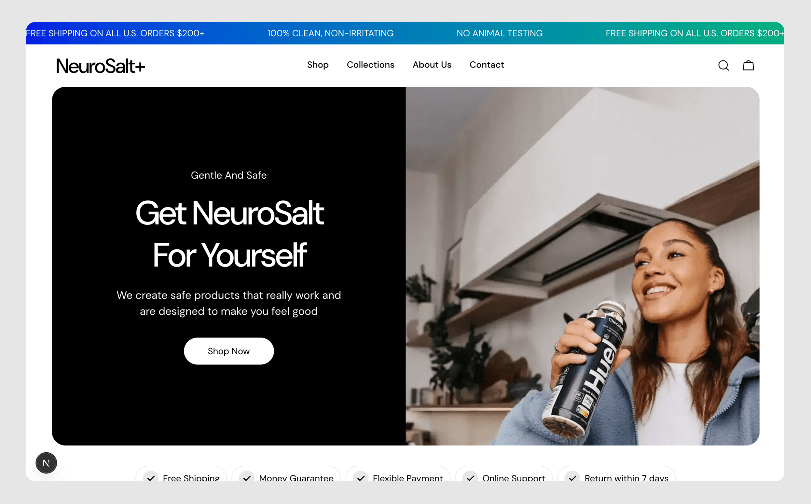
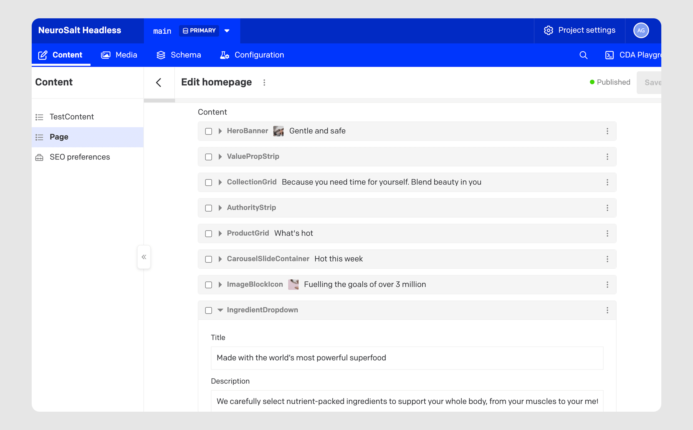
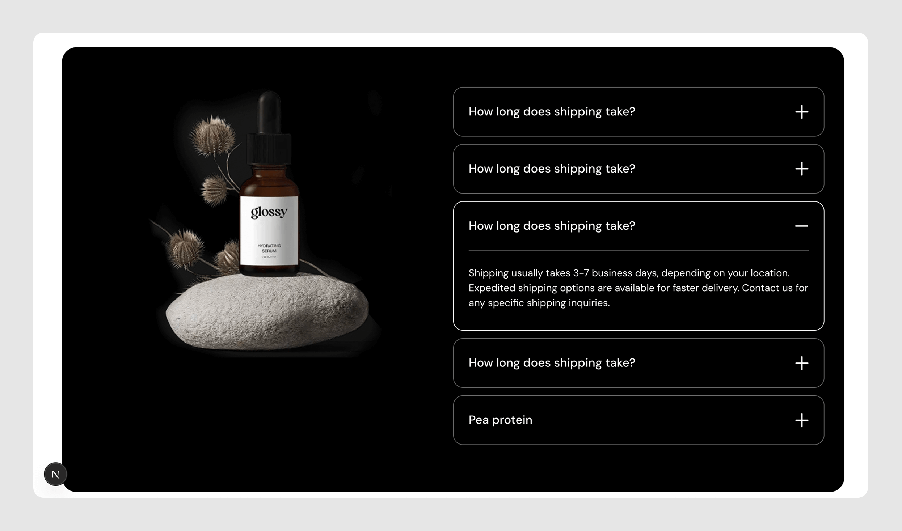
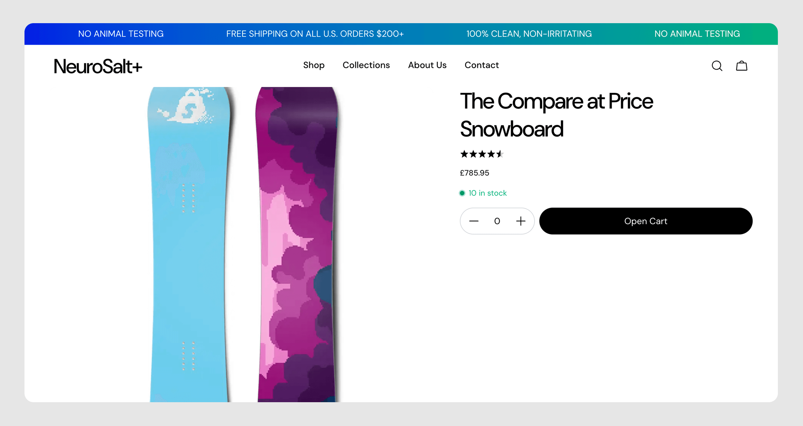

After working with Shopify's metafield system for 5+ years, I realised I’ve probably spent more time fighting with it than enjoying it. Even shiny new metaobjects feel pretty restrictive and clunky to use.

This friction drove me to explore headless commerce, to understand if there was a better way to build.

You can see full code on [GitHub](https://github.com/alexggmark/neurosalt-shopify-headless) and demo site on [Vercel](https://neurosalt-shopify-headless-ti1p.vercel.app/).

<mark>Full disclosure:</mark> this is an unfinished spec project. I quit development after realising headless is pretty much dead in the water, but it was still a useful exercise in Next.js architecture and type safety.



## The Architecture Decision

Rather than use Next.js's official Shopify template, I built from scratch. The goal was to understand the fundamentals and optimize setup myself.

The core challenge: recreating Shopify's block-based editing while splitting content between Shopify (product data) and DatoCMS (editorial content).

Here's the switch statement I used to compose pages:

(<mark>Note</mark>: yes - there's definitely a cleaner way to loop over these, but I didn't spend enough time standardising names)

```tsx
// page.tsx
import { getHomepageQuery } from "@/lib/dato/queries/getHomepage";
import { getProducts } from "@/lib/shopify";

import HeroBanner from "@/components/sections/HeroBanner";
import ValuePropStrip from "@/components/sections/ValuePropStrip";
import CollectionGrid from "@/components/sections/CollectionGrid";
import AuthorityBox from "@/components/sections/AuthorityBox";
import ProductGrid from "@/components/sections/ProductGrid";
import CarouselSlide from "@/components/sections/CarouselSlide";
import ImageBlockIcons from "@/components/sections/ImageBlockIcons";
import IngredientsDropdown from "@/components/sections/IngredientsDropdown";

export default async function Home() {
  const shopifyData = await getProducts();
  const homepageData = await getHomepageQuery();

  return (
    <>
      {homepageData.page?.content.map((block, index) => {
        switch (block.__typename) {
          case "HerobannerRecord":
            return <HeroBanner key={index} data={block} />
          case "ValuepropstripRecord":
            return <ValuePropStrip key={index} data={block} />
          case "CollectiongridRecord":
            return <CollectionGrid key={index} data={block} />
          case "AuthoritystripRecord":
            return <AuthorityBox key={index} data={block} />
          case "ProductgridRecord":
            return <ProductGrid key={index} shopifyData={shopifyData} data={block} />
          case "CarouselslidecontainerRecord":
            return <CarouselSlide key={index} data={block} />;
          case "ImageblockiconRecord":
            return <ImageBlockIcons key={index} data={block} />;
          case "IngredientdropdownRecord":
            return <IngredientsDropdown key={index} data={block} />;
        }
      })}
    </>
  );
}
```

In the above, DatoCMS controls which blocks appear and in what order, while components handle the rendering.



The components themselves are super simple thanks to rigid type-safety (more on that in a moment):

```tsx
// /components/sections/HeroBanner
import Image from "next/image";
import CartTrigger from "../cart/CartTrigger";
import Button from "../ui/Button";
import { HeroBannerBlock } from "@/lib/dato/types";

type Props = {
  data: HeroBannerBlock;
};

export default function HeroBanner({ data }: Props) {
  return (
    <div className="page-width">
      <div className="rounded-3xl flex overflow-hidden min-h-96">
        <div className="w-1/2 bg-black flex flex-col justify-center items-center md:py-36">
          <div className="text-white text-center max-w-[400px] flex flex-col items-center">
            <h3 className="text-[18px] mb-4 capitalize">{data.toptitle}</h3>
            <h1 className="font-heading-3xl mb-5">{data.title}</h1>
            <p className="font-body-lg mb-8">{data.description}</p>
            <div className="flex gap-4">
              <CartTrigger>
                <Button buttonText={data.ctatext ? data.ctatext : 'Nope'}></Button>
              </CartTrigger>
            </div>
          </div>
        </div>
        <div className="w-1/2 bg-slate-500 relative">
          <Image src={data.bannerimage ? data.bannerimage.url : "/images/placeholder.png"} width={600} height={600} alt="test" className="absolute w-full h-full object-cover" />
        </div>
      </div>
    </div>
  );
}
```

## Type Safety

One of my priorities was end-to-end type safety. But this meant implementing GraphQL codegen for both Shopify and DatoCMS. Initially, I tried combining them into a single setup, but quickly discovered this wasn't best practice - each system needs its own schema and generated types.

The Shopify codegen configuration (DatoCMS codegen basically identical, so use your imagination):

```tsx
// codegen.shopify.ts
import 'dotenv/config';
import type { CodegenConfig } from '@graphql-codegen/cli';

const config: CodegenConfig = {
  overwrite: true,
  schema: [
    {
      'https://neurosalt-headless.myshopify.com/api/2024-07/graphql.json': {
        headers: {
          'X-Shopify-Storefront-Access-Token': process.env.SHOPIFY_STOREFRONT_ACCESS_TOKEN!,
        },
      },
    }
  ],
  documents: 'src/lib/shopify/**/*.{ts,tsx}',
  generates: {
    'src/lib/shopify/graphql-types.ts': {
      plugins: ['typescript', 'typescript-operations'],
    },
  },
};

export default config;
```

This generates types from Shopify's Storefront API, making sure all queries match the schema exactly. When Shopify updates their API, types regenerate automatically.

(Which is good, because Shopify’s developer docs are pretty *rough*…)

## State Management

For cart and quick-shop functionality, I used context providers wrapped in a single ClientProviders component - a “barrel” pattern I borrowed from a previous SaaS project:

```tsx
'use client';

import { CartProvider } from "../cart/CartProvider"
import CartDrawer from "../cart/CartDrawer"
import { QuickShopProvider } from "../quick-shop/QuickShopProvider";
import QuickShopDrawer from "../quick-shop/QuickShopDrawer";

export default function ClientProviders({ children }: { children: React.ReactNode }) {
  return (
    <QuickShopProvider>
      <CartProvider>
        {children}
        <CartDrawer />
        <QuickShopDrawer />
      </CartProvider>
    </QuickShopProvider>
  );
}
```

The CartProvider itself is straightforward - just open/close state:

```tsx
export function CartProvider({ children }: { children: ReactNode }) {
  const [isOpen, setIsOpen] = useState(false);

  const openCart = () => setIsOpen(true);
  const closeCart = () => setIsOpen(false);

  return (
    <CartContext.Provider value={{ isOpen, openCart, closeCart }}>
      {children}
    </CartContext.Provider>
  );
}
```

And then animation happens using Framer Motion (more on that in next section).

```tsx
'use client';

import { useCart } from './CartProvider';
import { motion, AnimatePresence } from 'framer-motion';
import { useEffect } from 'react';

export default function CartDrawer() {
  const { isOpen, closeCart } = useCart();

  useEffect(() => {
    document.body.style.overflow = isOpen ? 'hidden' : '';
    return () => {
      document.body.style.overflow = '';
    };
  }, [isOpen]);

  return (
    <AnimatePresence>
      {isOpen && (
        <>
          <motion.div
            className="fixed inset-0 bg-black/50 z-40"
            initial={{ opacity: 0 }}
            animate={{ opacity: 1 }}
            exit={{ opacity: 0 }}
            transition={{ duration: 0.1 }}
            onClick={closeCart}
          />
          <motion.div
            initial={{ x: '100%' }}
            animate={{ x: 0 }}
            exit={{ x: '100%' }}
            transition={{ duration: 0.1 }}
            className="fixed right-0 top-0 h-full w-[400px] bg-white shadow-lg z-50 p-6"
          >
            <button onClick={closeCart} className="mb-4">Close</button>
            <h2 className="text-xl font-bold mb-4">Your Cart</h2>
          </motion.div>
        </>
      )}
    </AnimatePresence>
  );
}
```

This keeps the provider lightweight while allowing any component to trigger cart interactions via useCart().

## Animation Without Reinvention

I have a strict personal rule: never solve a problem that’s already solved. Animating presence is painful in vanilla JavaScript, so I used Framer Motion.



Here's an accordion component that handles smooth height transitions:

```tsx
import { useState } from 'react';
import { motion, AnimatePresence } from 'framer-motion';

// …

<AnimatePresence initial={false}>
  {openIndex === index && (
    <motion.div
      initial={{ height: 0 }}
      animate={{ height: 'auto' }}
      exit={{ height: 0 }}
      transition={{ duration: 0.3, ease: 'easeInOut' }}
      className="overflow-hidden"
    >
      <motion.div
        initial={{ opacity: 0, y: -10 }}
        animate={{ opacity: 1, y: 0 }}
        exit={{ opacity: 0, y: -10 }}
        transition={{ duration: 0.2, ease: 'easeOut' }}
      >
        {/* Content */}
      </motion.div>
    </motion.div>
  )}
</AnimatePresence>
```

Framer Motion handles the complex choreography of height animations and unmounting, letting me focus on the user experience rather than animation math.

## What I Learned

For most Shopify projects, the platform's built-in theming system is enough. Headless adds complexity - separate deployments, API management, preview environments - that only makes sense at scale or with specific technical requirements.

However, for headless, type safety is worth the setup cost. GraphQL codegen caught a bunch of issues during development that would've silently failed on the frontend otherwise…

Finally, data architecture should mirror existing mental models. The block-based content system works because it's familiar to anyone who's used Shopify's theme editor. No conceptual overhead, etc etc…

## Current State

The homepage is fully functional with all sections rendering dynamically. The product page successfully pulls price data and images from Shopify's Storefront API. What's missing: mutations - add to cart, checkout, etc.



Will I finish this? Probably not. The exercise achieved its goal: proving I could build a headless Shopify store from scratch while understanding the trade-offs.

For actual client work, I'd likely stick with Dawn or Horizon unless requirements specifically justified the headless complexity (and the team on the other end was super competent).
