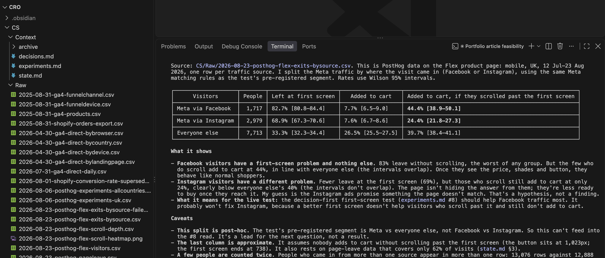
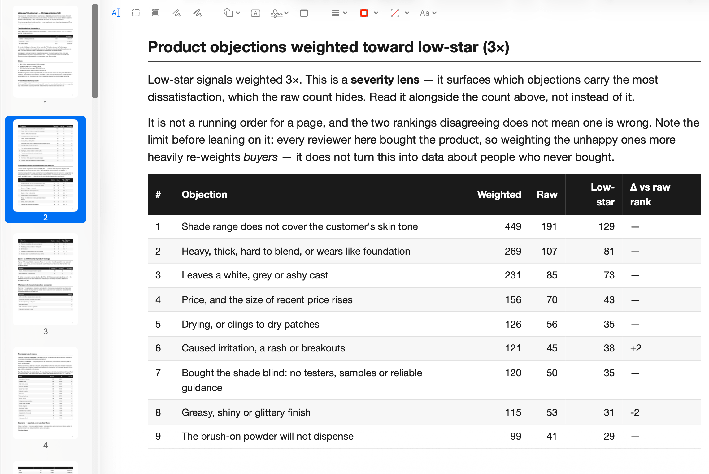
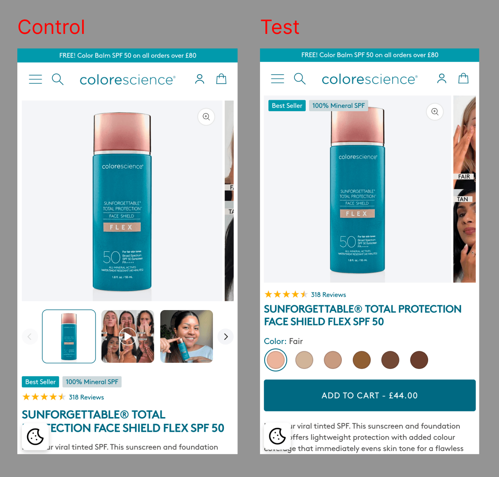

I've talked to a lot of senior developers this year who tell me they burn through <mark>millions of tokens a day</mark>.

So I ask how they're doing that. The answer is usually: summarising documents, rewording emails, reading files they could have skimmed. It all sounds less like a workflow and more like someone trying to hit a quota.

(You'd be surprised how common this is…)

I only want to use AI where it's genuinely useful. And after a year of trying, that's a fairly specific place: AI is excellent at reading lots of data and spotting patterns. It's much weaker at producing the concrete thing you should do about it.

For me, that place is **CRO analysis**. I do CRO and web development for a few premium skincare Shopify stores (PostHog, GA4, lots of CSVs). Here's how Claude Code fits in.

---

## Why I use Claude Code in a repo

All my analysis lives in one repo, opened in VS Code, with Claude Code working directly on the files. That gives me a few things I'd want from any analyst:

- **Every number has a source.** Claude reads the exports itself and runs scripts, so figures are computed, not remembered
- **Every session starts from the same place.** The rules and current facts load automatically, with no handoff summaries
- **Every change is reviewable.** Claude's edits show up as diffs, and nothing goes in until I've read it
- **Version control proves the order of events.** A git commit timestamp shows a test's method was fixed *before* its data came in



One important caveat: <mark>the repo never goes near GitHub</mark>. Even anonymised, it's real business data, so it stays local, with git used purely for history. Version control doesn't have to mean a remote.

---

## On security

Every export is anonymised before it's committed: personal identifiers are stripped and free-text fields blanked, and reviews are identified by a numeric ID only. Claude only ever sees what it needs to spot a pattern, and a pattern never needs to know who someone is.

---

## The repo is the operating manual

The folder structure isn't tidiness. It's what makes the AI reliable.

```
CLAUDE.md                 # house rules, loaded every session
<STORE>/
  Raw/                    # source exports, never edited
    README.md             # each file's original name + its traps
  Context/
    state.md              # current facts, loaded every session
    decisions.md          # why we did / didn't; append-only
    experiments.md        # pre-registration + result per test
    archive/              # old chat-era notes, "unverified"
  Snapshots/              # dated screenshots
  scripts/                # reproduce every result from Raw/
```

The conventions that do most of the work:

- **`Raw/` is never edited**, and files are named by the last day the data covers, so Claude knows from the filename whether it's the right window
- **`Raw/README.md` records each export's traps** (dates stored as text, an event that changed how it counts mid-year, GA4 filing email under "Unassigned"), so no session has to rediscover them
- **Written authority order:** recomputed from `Raw/` > decisions and experiments > archive > anything remembered from chat
- **`decisions.md` is append-only.** Wrong conclusions get marked `Superseded`, never deleted, and Claude reads it before suggesting anything
- **One folder per store**, and findings don't carry between them unless I ask

---

## The rules

These live in `CLAUDE.md`. Each one exists because something went wrong without it.

- **Discuss first; only write files once I approve.** I stay the editor.
- **Fix the method before looking at the data.** Models rationalise towards the result, just like people.
- **Never switch metrics after seeing results.**
- **Recompute from `Raw/`, never recall.** This one line killed number drift.
- **Flag your own mistakes plainly.** In writing, in the file.
- **Label post-hoc checks as post-hoc.**
- **Build the promotion calendar from order data, never memory.** (This one was for *me*: I "remembered" a June sale that never happened…)
- **Ask for the minimum data the decision needs.** Claude once asked me for order-level rows, VAT details and a three-way reconciliation to confirm a conclusion that was already visible in the first file.

---

## Why I still export by hand

Deliberately:

- **Every question needs a different cut**, so a fixed pipeline would reliably export the wrong thing
- **Checking a fresh export is where problems surface**: session counting changing mid-year, orders and "completed checkouts" differing by a third, channels misfiled. A pipeline would carry those silently into a dashboard
- **Exporting takes minutes; interpreting is the job**

I'll automate once the tracking is trustworthy enough for a proper warehouse. Not before.

---

## Where I do automate: reviews

As someone who used to do voice-of-customer analysis completely by hand, this is where I've felt the biggest difference. I learned VoC through CXL's growth marketing approach: copy each review or snippet into a Google Form, tag it, and let the responses build a pivot table in Google Sheets. It works, but it's slow, and by review 300 you're skimming.



The difference now is night and day. It's not just faster. Patterns are much easier to spot, because nothing gets skimmed and every theme comes with counts.

Review analysis is stable and repetitive, so it gets a small Python pipeline built with Claude Code:

1. Collect every review into a read-only file
2. Claude extracts "signals" per review (objections, what convinced them) plus one exact quote, returning null rather than guessing
3. Group signals into themes
4. Output a dated PDF that drops into the CRO repo like any other export

Two things I'm pleased with:

- **It runs inside Claude Code, not the API.** The corpus is tens of thousands of tokens; there's no point paying separately for a model to read short reviews
- **Every quote is checked against the original review**, character by character, because these end up as on-page copy. On one store that caught 21 bad quotes and snapped 131 back to the customer's exact wording.

It also caught things I hadn't anticipated, like the fact that only about 1 in 18 of the reviews showing on one store actually belonged to it. The rest were syndicated from the US brand's account.

---

## Where Claude is strong

Three real examples, showing both what it caught and where it got things wrong.

### The purchase decision was below the first screen

- Claude joined PostHog scroll depth to add-to-cart for ~12,900 mobile visitors on one best-selling product page, and mapped it against where the price and Add to Cart button sit on a phone
- **Pattern:** Add to Cart sat below the first screen. Visitors who never scrolled past it added to cart at **2.3%**. Visitors who scrolled just past the button: **42%**
- Claude flagged it as <mark>correlational</mark> (people who scroll are keener anyway), which is exactly why it became a pre-registered test rather than a straight ship

### Claude's own mistake, caught by Claude's own method

- One product page gets almost all our paid social traffic. Claude saw that **22%** of those visits added to basket, but only about 1% bought, and concluded people were getting lost in checkout
- The catch: GA4 was counting add-to-basket *clicks*, not people. Tap the button three times and you count three times
- Before digging further, we wrote down the method and committed it: count people, not clicks, and compare each step of the funnel for paid social against everyone else
- Fifteen minutes later, the answer: counted by people, only **6%** added to basket. 94% left the page without adding anything, and the few who did weren't doing any worse in checkout than anyone else
- Scroll data showed two-thirds of paid social visitors on mobile left within the top 10% of the page. A heatmap capture showed why: the cookie banner sat right over the product name
- So the problem moved from checkout to the first screen

### Restarting a test for the right reason



- **The setup:** a mobile-only design test, shown to all screen sizes because 95% of our traffic is mobile. Claude agreed
- **The peek:** three days in, checkout conversion was down **34%**. My instinct was to pull it. Claude: the main metric (add to cart) is only down 1%, and the checkout figure rests on 10–15 orders. That's noise
- **The real problem:** the test only counts visitors who accept cookies, and desktop visitors accept more often. So desktop was over-represented, watering down the result and making the test run up to a quarter longer
- **The restart:** we restarted, limited to mobile, because the setup was flawed, not because of the peek. Now the test measures only the people the change was designed for, and its result will actually mean something

**It's also good at:** reconciling GA4, Shopify and PostHog; splitting a conversion drop into "colder traffic" vs "worse site"; and turning hundreds of reviews into counted themes.

---

## Where Claude is weak

Claude is great at describing *what's* happening. It's much weaker at deciding what to build.

Its suggestions drift towards generic best practice and long hedged lists, blind to:

- what the theme can do, and what it costs
- what's bold enough to measure
- brand tone and compliance
- what stakeholders will sign off
- what's already been tried

So the split is simple:

- **Claude** finds, measures and describes
- **I** decide what to change, then use Claude to stress-test it
- Ideas go into `decisions.md` as hypotheses, never as results

The model sees the data and the docs, not the business or the people. Analysis mostly lives in the files. Good ideas mostly don't.

---

## Final thoughts

The AI is useful *because* it's constrained: written rules, untouchable inputs, an append-only record, and a human who commits. Take those away and you've got a very confident narrator.

None of it needs millions of tokens a day. Just a folder structure, a few rules and the discipline to write things down.
