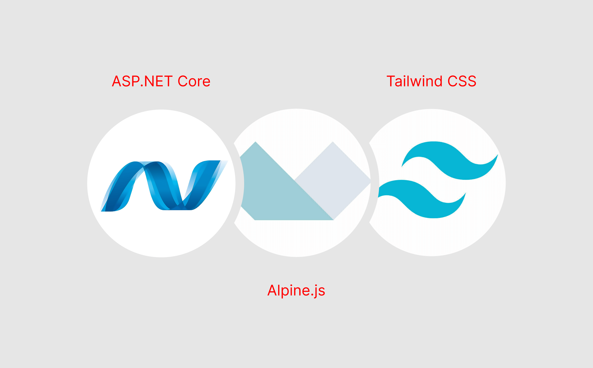
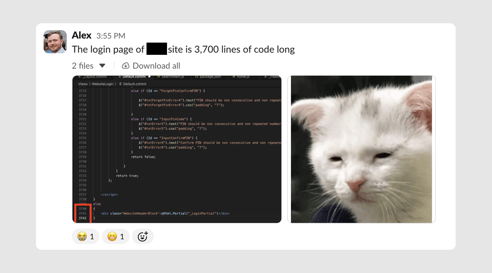
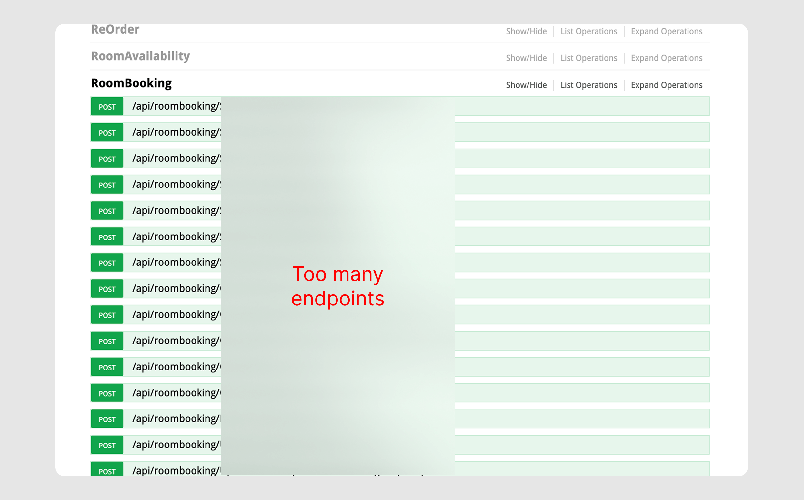

I’m currently working on a genuinely challenging project that I thought was worth sharing: modernising a decade-old ASP.NET eComm platform that handles millions in revenue. (Key details NDA, sorry!)



Although my initial thoughts were “let’s scrap it and rebuild in Next.js”, I quickly realised this wasn't the smart move.

Instead, I ended up using Alpine.js and Tailwind CSS to modernise the frontend while <mark>working with the legacy system</mark>, not against it. It’s turning out to be one of my favourite projects, and a perfect use case for a stack I'd been fantasising about using for ages.

## The starting point

The platform I’m working with has been serving people for 10+ years. It was built on ASP.NET, managed by a third-party backend team, and handled everything from product sales to training course bookings to room reservations.

The backend team was in the process of upgrading to ASP.NET Core and migrating to _[REDACTED]_ for ERP - this wasn't just a web project, it's a full biz opp overhaul.

My role as the frontend developer was to figure out how to modernise the user experience while the backend underwent its own transformation.

But… the existing codebase was challenging. Some CSHTML files stretched to <mark>5,000+ lines</mark>. jQuery handled every single form interaction - repetitive code everywhere. But, the actual ASP logic wasn’t overly complex and worked fine. It just needed to look and feel better.



## Why not a complete rebuild?

My first instinct was to pitch a full Next.js rebuild. I even went as far as getting the backend team to generate Swagger documentation so we could see exactly what we were working with.

The result? Over 40 POST/GET endpoints for a single feature like room booking. I went as far as mocking up a dummy Next.js frontend, planned out authentication middleware, and mapped out the entire architecture…



…then stopped when it dawned on me what all this would actually mean.

A complete rebuild means recreating 10+ years of custom functionality in a new language. Each edge case. Each business rule. Each integration.

The risk was enormous, and the timeline would stretch far beyond what was practical for a business that needed to keep operating and evolving.

So instead, I pushed early on to separate core functionality - suggesting we move training and room booking to dedicated platforms like TalentLMS. My idea was making the system less monolithic and a little more micro.

## Alpine.js and Tailwind CSS

Once I accepted that we’d be working within the existing ASP.NET architecture, the solution became clearer: Alpine.js and Tailwind CSS.

This is genuinely my favourite stack when combined with Vite, but I'd never had a proper use case for it until this project. And it turned out to be perfect for exactly this scenario.

## Why This Stack Makes Sense

Alpine.js gives us reactivity without the framework overhead. It's lightweight enough that we could add it to legacy pages without bundling or complex build processes.

Tailwind solves the consistency problem. I'm firmly in the camp of thinking developers should have to write 1,000 words explaining why NOT to use Tailwind rather than the other way around. For this project, it was non-negotiable. When you're modernising a legacy system, consistency is everything - and Tailwind enforces that by design.

With this, I could introduce component-based thinking, reactive state management, and modern UI patterns without touching the backend or rewriting business logic.

The below is code I repurposed from [Pines UI](https://devdojo.com/pines) - but it should give you an idea of how <mark>massively powerful</mark> Alpine + Tailwind is for UI development.

```html
<!-- COMPONENT: SLIDE DRAWER (stolen from PinesUI!) -->
<div x-data="{ 
    slideOverOpen: false 
  }"
  class="relative z-50 w-auto h-auto flex justify-center"
>
  <button @click="slideOverOpen=true" class="mt-12 cursor-pointer inline-flex justify-center items-center px-4 py-2 h-10 text-sm font-medium bg-white rounded-md border transition-colors hover:bg-neutral-100 active:bg-white focus:bg-white focus:outline-none focus:ring-2 focus:ring-neutral-200/60 focus:ring-offset-2 disabled:opacity-50 disabled:pointer-events-none">
    Click to Open Slide Drawer
  </button>
  <template x-teleport="body">
      <div 
          x-show="slideOverOpen"
          @keydown.window.escape="slideOverOpen=false"
          class="relative z-[99]">
          <div x-show="slideOverOpen" x-transition.opacity.duration.600ms @click="slideOverOpen = false" class="fixed inset-0 bg-black/10"></div>
          <div class="overflow-hidden fixed inset-0">
              <div class="overflow-hidden absolute inset-0">
                  <div class="flex fixed inset-y-0 right-0 pl-10 max-w-full">
                      <div 
                          x-show="slideOverOpen" 
                          @click.away="slideOverOpen = false"
                          x-transition:enter="transform transition ease-in-out duration-500 sm:duration-700" 
                          x-transition:enter-start="translate-x-full" 
                          x-transition:enter-end="translate-x-0" 
                          x-transition:leave="transform transition ease-in-out duration-500 sm:duration-700" 
                          x-transition:leave-start="translate-x-0" 
                          x-transition:leave-end="translate-x-full" 
                          class="w-screen max-w-md">
                          <div class="flex overflow-y-scroll flex-col py-5 h-full bg-white border-l shadow-lg border-neutral-100/70">
                              <div class="px-4 sm:px-5">
                                  <div class="flex justify-between items-start pb-1">
                                      <h2 class="text-base font-semibold leading-6 text-gray-900" id="slide-over-title">Slide Over Title</h2>
                                      <div class="flex items-center ml-3 h-auto"> 
                                          <button @click="slideOverOpen=false" class="flex absolute right-0 z-30 justify-center items-center px-3 py-2 mt-6 mr-5 space-x-1 text-xs font-medium uppercase rounded-md border border-neutral-200 text-neutral-600 hover:bg-neutral-100">
                                              <svg xmlns="http://www.w3.org/2000/svg" fill="none" viewBox="0 0 24 24" stroke-width="1.5" stroke="currentColor" class="w-4 h-4"><path stroke-linecap="round" stroke-linejoin="round" d="M6 18L18 6M6 6l12 12"></path></svg>
                                              <span>Close</span>
                                          </button>
                                      </div>
                                  </div>
                              </div>
                              <div class="relative flex-1 px-4 mt-5 sm:px-5">
                                  <div class="absolute inset-0 px-4 sm:px-5">
                                      <div class="overflow-hidden relative h-full rounded-md border border-dashed border-neutral-300"></div>
                                  </div>
                              </div>
                          </div>
                      </div>
                  </div>
              </div>
          </div>
      </div>
  </template>
</div>
```

That's it! Everything happens directly inside HTML with zero build tools.

If this was Shopify Dawn code, it'd be a 700-line long `SlideDrawer` web component that extends `class DrawerDialogModal`…

(I'm exaggerating, but _not much!_)

## The Development Pattern

With some 5,000+ line behemoths lying in the codebase, I had to create a clear pattern for refactoring the existing CSHTML files:

- ASP data loads at the top of the file - keeping the existing server-side logic intact
- Data pipes into Alpine with x-data - bridging the gap between server and client state
- Custom functions live in script tags at the bottom - keeping JS organized and contained (I don't like JS-in-html _that much_)

This made everything reactive while allowing me to safely scrap years of legacy HTML and CSS. We weren't fighting against ASP.NET's architecture - we were enhancing it.

Below is a super simple example of how I'm setting up code:

```html
<!-- ASP.NET data loads at top  -->
@model ProductEntityModel

@{
  var product = @Html.Raw(Json.Encode(Model));
}

<!-- productCard lives in bottom <script> tags  -->
<div x-data="productCard(@product)" class="max-w-md mx-auto bg-white rounded-lg shadow-md overflow-hidden">
  <div class="relative">
    

    <div x-show="inStock"
      class="absolute top-4 right-4 bg-green-500 text-white px-3 py-1 rounded-full text-sm font-medium">
      In Stock
    </div>
    <div x-show="!inStock"
      class="absolute top-4 right-4 bg-red-500 text-white px-3 py-1 rounded-full text-sm font-medium">
      Out of Stock
    </div>
  </div>

  <div class="p-6">
    <h2 class="text-2xl font-bold text-gray-900 mb-2" x-text="product.name"></h2>
    <p class="text-gray-600 mb-4" x-text="product.description"></p>

    <div class="flex items-baseline gap-2 mb-6">
      <span class="text-3xl font-bold text-gray-900">£<span x-text="totalPrice"></span></span>
      <span class="text-sm text-gray-500" x-show="quantity > 1">
        (£<span x-text="product.price.toFixed(2)"></span> each)
      </span>
    </div>

    <div class="flex items-center gap-4 mb-6" x-show="inStock">
      <span class="text-sm font-medium text-gray-700">Quantity:</span>
      <div class="flex items-center border border-gray-300 rounded-lg">
        <button @click="decrementQuantity()" :disabled="quantity <= 1"
          :class="quantity <= 1 ? 'opacity-50 cursor-not-allowed' : 'hover:bg-gray-100'"
          class="px-4 py-2 text-gray-600 transition-colors">
          -
        </button>
        <span class="px-6 py-2 text-gray-900 font-medium" x-text="quantity"></span>
        <button @click="incrementQuantity()" :disabled="quantity >= product.stockLevel"
          :class="quantity >= product.stockLevel ? 'opacity-50 cursor-not-allowed' : 'hover:bg-gray-100'"
          class="px-4 py-2 text-gray-600 transition-colors">
          +
        </button>
      </div>
      <span class="text-sm text-gray-500" x-text="`${product.stockLevel} available`"></span>
    </div>

    <button @click="addToCart()" :disabled="!inStock"
      :class="inStock ? 'bg-blue-600 hover:bg-blue-700' : 'bg-gray-400 cursor-not-allowed'"
      class="w-full py-3 px-6 text-white font-semibold rounded-lg transition-colors duration-200">
      <span x-show="!addedToCart">Add to Cart</span>
      <span x-show="addedToCart" class="flex items-center justify-center gap-2">
        <svg class="w-5 h-5" fill="none" stroke="currentColor" viewBox="0 0 24 24">
          <path stroke-linecap="round" stroke-linejoin="round" stroke-width="2" d="M5 13l4 4L19 7"></path>
        </svg>
        Added to Cart!
      </span>
    </button>
  </div>
</div>

<script>
  // Alpine component function - now I'm free to manipulate data
  function productCard(productData) {
    return {
      product: productData,
      quantity: 1,
      inStock: productData.stockLevel > 0,
      addedToCart: false,

      get totalPrice() {
        return (this.product.price * this.quantity).toFixed(2);
      },

      addToCart() {
        // actual addd to cart logic would live here
        this.addedToCart = true;
        setTimeout(() => this.addedToCart = false, 2000);
      },

      incrementQuantity() {
        if (this.quantity < this.product.stockLevel) {
          this.quantity++;
        }
      },

      decrementQuantity() {
        if (this.quantity > 1) {
          this.quantity--;
        }
      }
    }
  }
</script>
```

Obviously the above is just an example of a reactive component. For content-heavy pages like blogs and content, I'm still relying on ASP.NET for some marginal SEO benefits.

Another benefit of ASP.NET is that we can use "partials" like components - so code is separated and imported. That's why I'm so keen on keeping ASP/Alpine so bundled together, so we can drop components in anywhere!

## Optimising early

One of my core principles is to optimise as early as possible in a project. With this stack, that meant:

- Leveraging component libraries like [Pines UI](https://devdojo.com/pines). Why build everything from scratch when 50% of the logic already exists? I could focus on the unique business requirements while using battle-tested components for standard patterns.

- Pushing our UX designer toward UI kits. I picked [FlowBite V3 Figma library](https://www.figma.com/community/file/1522519996630594183/flowbite-design-system-pro-v3-0) because it gave us everything we needed for an enterprise-level eComm project. No more trying to create every button, form, and card component. No more inconsistent spacing values that become a nightmare to implement.

- Working with the backend, I pushed hard to keep all data consistent. The backend could be upgraded to ASP.NET Core without changing data patterns or names on the frontend. This meant I could build UI knowing the ground wouldn't shift underneath me.

## Masking performance problems

One of the biggest challenges is that the backend can be slow. It often pulls data from third-party services or scrapes content from other websites - homepage blog posts, for example, are pulled from an entirely separate site and can take up to 5 seconds to load.

This is where Alpine.js really shines. I’m creating skeleton loaders for everything, giving the perception of a much faster site than what we actually have. It means users see feedback immediately rather than staring at a blank screen with janky layout shifting.

## Content Management

I considered using Sanity or DatoCMS for marketing content (dunno, felt trendy), but ultimately decided against it.
Without a framework like Next.js to properly handle that integration, it would just mean loading even more data into an already slow ASP.NET project. Not optimal.

Instead, I used simpler JSON objects to handle data like navigation. This meant I could build mobile and desktop versions with consistent content, and anyone on the team could easily jump in and update it later without needing to learn a new CMS.

```js
// Example of function passed to x-data
function navigationMenu() {
        return {
            navigationMenuOpen: false,
            navigationMenu: '',
            navigationMenuCloseTimeout: null,
            navigationMenuCloseDelay: 200,

            menuItems: [
                {
                    id: 'getting-started',
                    label: 'Getting Started',
                    dropdown: true
                },
                {
                    id: 'learn-more',
                    label: 'Learn More',
                    dropdown: true
                },
                {
                    id: 'documentation',
                    label: 'Documentation',
                    url: '#documentation',
                    dropdown: false
                },
                {
                    id: 'learn-more',
                    label: 'Learn More',
                    dropdown: false
                },
            ],

            dropdownContent: {
                'getting-started': {
                    columns: [
                        {
                            type: 'links',
                            title: 'Quick Start',
                            links: [
                                {
                                    title: 'Introduction',
                                    description: 'Learn the basics and get up to speed quickly',
                                    url: '#introduction'
                                },
                                {
                                    title: 'Installation',
                                    description: 'Set up your development environment',
                                    url: '#installation'
                                },
                                {
                                    title: 'First Project',
                                    description: 'Build your first project step by step',
                                    url: '#first-project'
                                }
                            ]
                        },
                        // etc etc
```

## Why this approach works for legacy systems

As I’ve said over and over, I have a strong tendency to want to rebuild everything from scratch whenever I run into legacy code. Sometimes it’s the right call. But often, the pragmatic choice is to meet the system where it is and incrementally improve it.

Alpine.js and Tailwind CSS are perfect for this middle ground. They bring modern development practices and UX patterns to legacy codebases without requiring a complete rewrite. You get:

- Progressive enhancement - add reactivity where it matters most
- No build process required initially - start delivering value immediately
- Fast onboarding - any developer familiar with modern JS can contribute

For a complex, mission-critical platform, this pragmatic approach delivered results without the risk and timeline of a complete rebuild.

## Final thoughts

This project is still active and pre-launch, so I can't share too much detail. But I wanted to write about it because it's been genuinely satisfying to work on.

What I’m enjoying most is finding ways to speed up development. UI kits, component libraries, Alpine.js, Tailwind… these all feel like what web dev should be, and they actually help deliver value to companies faster. A genuine no brainer.

I’ll keep you posted, anyway. This post may eventually become a case study, but full migration of backend could be months away.