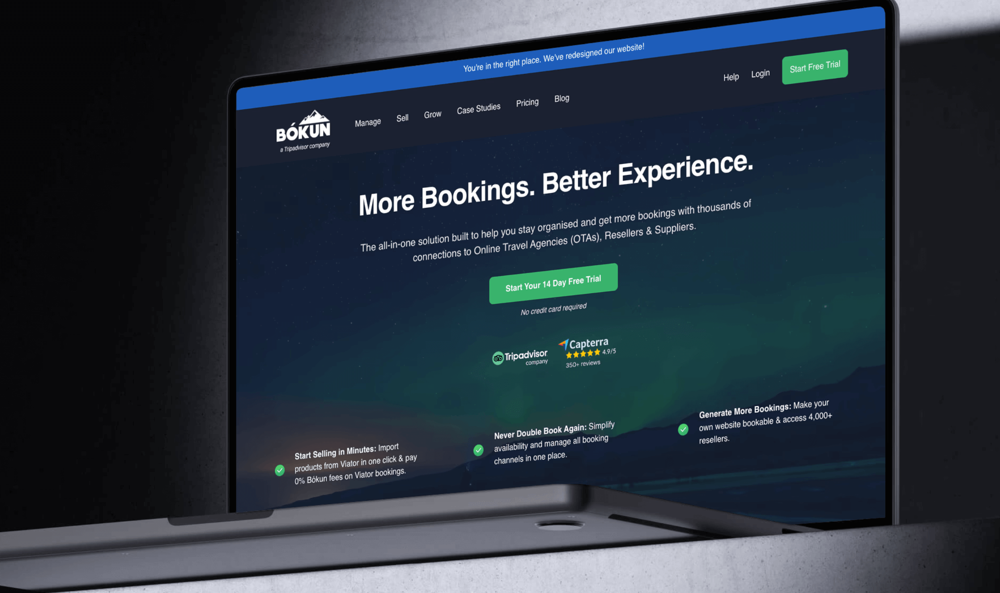

[Bokun](https://www.bokun.io/) is a B2B booking SaaS based in Iceland that helps tour operators manage and sell bookings. After being acquired by TripAdvisor, they wanted to scale their acquisition. I joined as CRO consultant to rework their signup funnel, and 3 months post-launch <mark>CVR increased 29.3%</mark>.

***

## Business Context

Bokun was driving traffic but failing to convert visitors into qualified trial users. Their conversion rate sat at 2.3%, below the B2B SaaS benchmark of 3-5%, and 50%+ of trial signups were poor fits that never closed.

The business's CPA had reached an unsustainable level, and the sales team reported that many trial signups didn't match their ideal customer profile, resulting in poor trial-to-paid CVR.

In B2B SaaS, improving top-of-funnel conversion has a compounding effect on revenue (_Geometric Growth!_) because it lowers CPA while also increasing the volume of qualified leads entering the pipeline.

***

## Problem & Analytics

On our initial calls, I noticed a major disconnect. Bokun was fixated on attracting enterprise clients, but the majority of their revenue came from small to mid-sized tour operators. This led to product messaging that alienated their core audience.

GA4 showed visitors skimming the homepage before navigating directly to pricing - very common in B2B SaaS comparison shoppers.

I started with a 31-page heuristic audit that highlighted where the site focused on enterprise features like "scalability" and "API access" (which mean nothing to small operators struggling with Excel spreadsheets).

***

## Research Strategy

Instead of traditional UX personas, I wanted to do direct customer research on reviews. I find this is often more helpful as it avoids those _"Bob, 37, wants to buy our product!"_ personas that never lead anywhere…

To make things even more quantitative, I wrote a Python script to scrape 1,000+ reviews from G2, Capterra, and TrustRadius. Sentiment analysis showed three themes dominating positive reviews: ease of implementation (67%), Viator integration (54%), and customer support (48%).

The enterprise features Bokun emphasized barely registered - API capabilities appeared in fewer than 2% of reviews.

Critically, the analysis showed how customers actually described their problems: "double bookings," "manual processes," and "spreadsheet hell" - not the "robust booking management solutions" language Bokun was using. This gap represented a massive opportunity.

***

## Strategic Framework & Wireframing

Working with the UX designer on information architecture, I took ownership of wireframing and messaging strategy. This tight integration is critical in B2B SaaS, where offer messaging is often the strongest conversion lever.

I gathered findings into three key problems: (1) users couldn't find pre-sales answers, (2) pricing page value propositions were unclear, and (3) critical feature pages received no traffic. Most B2B buyers actually jump directly to pricing and integrations.

The new structure prioritized direct access to what users needed. We created a dedicated "Integrations" navigation item, surfaced implementation services prominently, and restructured the pricing page around clear use cases rather than undifferentiated tiers. Each tier included specific volume indicators so visitors could immediately identify their fit.

I rewrote the homepage to lead with three outcomes dominating our research: eliminating double bookings, automating manual processes, and growing OTA sales.

The wireframes also addressed a critical finding: trial signup friction was too high. The existing flow asked for business details, booking volume, and implementation timeline upfront. I redesigned it to collect only email and password initially, moving qualification questions into product onboarding - maximizing volume and qualifying later.

***

## Implementation & Results

I prepared detailed specs to hand over to our dev team, explaining why specific elements mattered for conversions. I also designed a post-launch testing roadmap for hero messaging variations, pricing presentation formats, and signup form tests. Implementation took six weeks with close collaboration to preserve conversion principles.

Within eight weeks, trial signup conversion increased 29.3% from 2.3% to 3.0%. Most importantly, 6 months on, qualified trial percentage had increased 2X - we were finally converting the right visitors.

***

## Key Learnings

In B2B SaaS, information architecture problems often masquerade as design or offer problems. Bokun needed content designed around buyer decision-making. In the end, customer research revealed what talking to the owners couldn't. 

Lead quality matters as much as volume. The improvement in qualification rates may have been more valuable than the conversion lift itself. Optimising only for top-of-funnel without considering downstream metrics can overwhelm sales with unqualified leads.

Finally, messaging and positioning are often the highest-leverage factors in B2B SaaS. We achieved 29.3% lift mainly by restructuring information architecture and rewriting value propositions to match customer language. Many B2B SaaS companies are sitting on substantial improvements that don't require expensive redesigns, just better alignment between what they're saying and what customers actually care about.