I led a complete rebuild and ongoing optimisation program for [HydroPeptide UK](https://hydropeptide.co.uk/), transitioning from an unmaintainable legacy Shopify theme to a modern, test-ready platform.

Through strategic site architecture and continuous experimentation, we achieved <mark>11.1% increase in AOV</mark> and <mark>32.4% increase in RPV</mark> over 4 months.

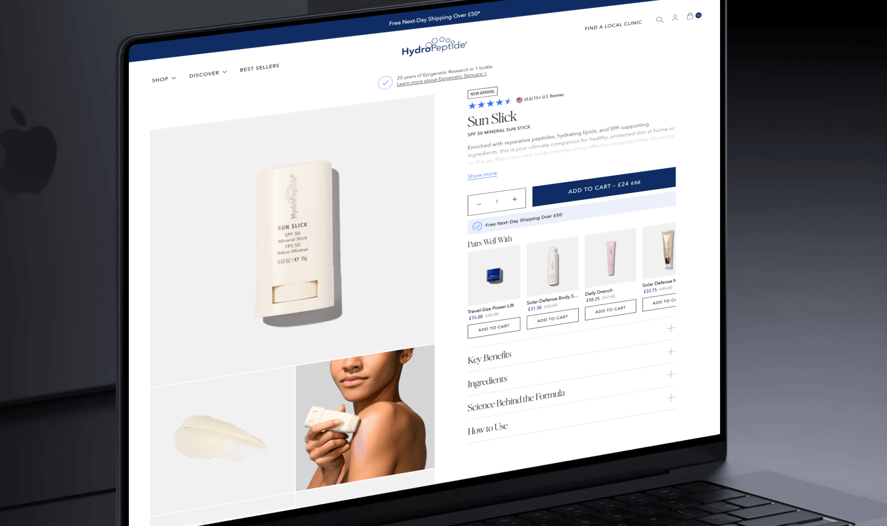

***

## Business Context

HydroPeptide is a premium US-based skincare brand targeting women in the UK market. When I took on this project, the site was running on an inherited Shopify theme from 2018, patched up with bad jQuery and third-party apps.

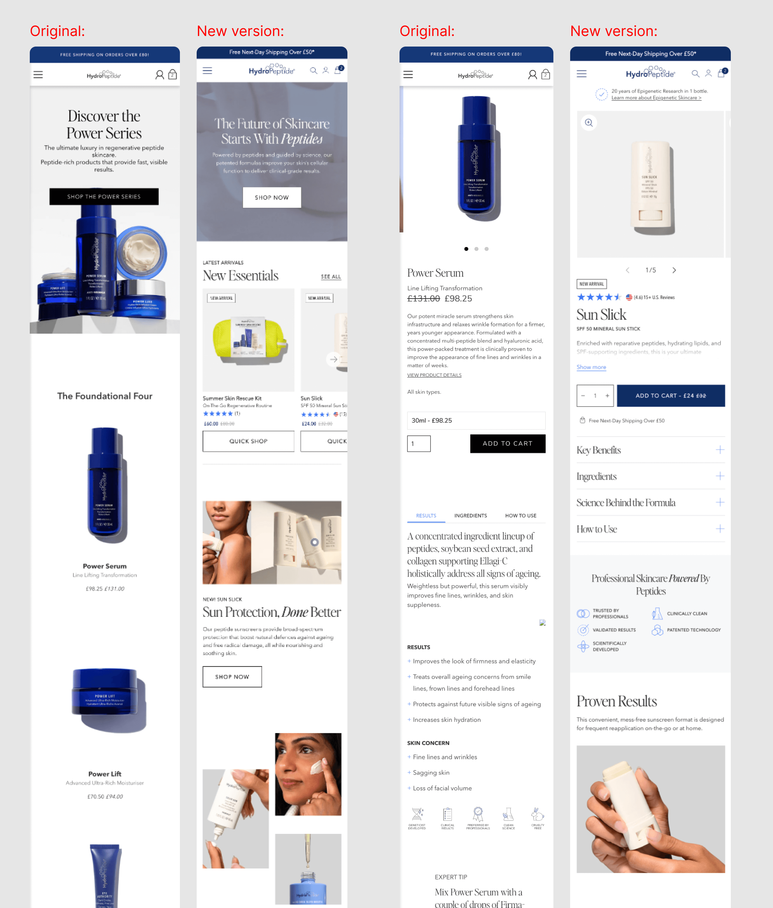

The business had never employed a dedicated web developer, relying instead on plug-and-play solutions that created significant technical debt. Performance was suffering, the codebase had become unmaintainable, and revenue metrics reflected these issues.

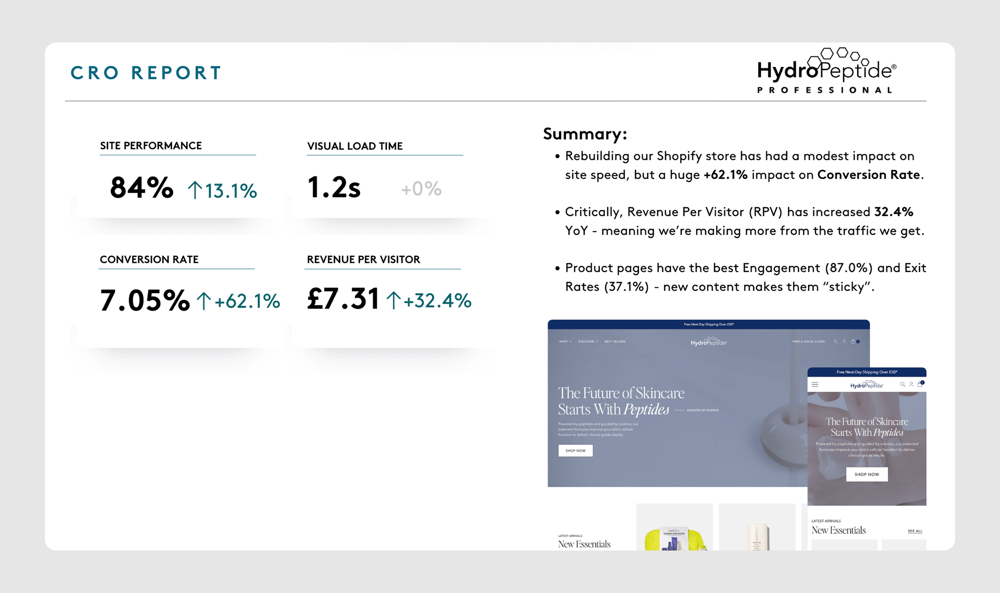

Getting buy-in for a complete rebuild took considerable effort, as the company hadn’t previously prioritised technical infrastructure.

***

## Problem & Analytics

The data painted a clear picture: we had a reasonably strong 3-month LTV, but 12-month LTV was abysmal. This suggested we were capturing initial purchases but failing to retain customers long-term.

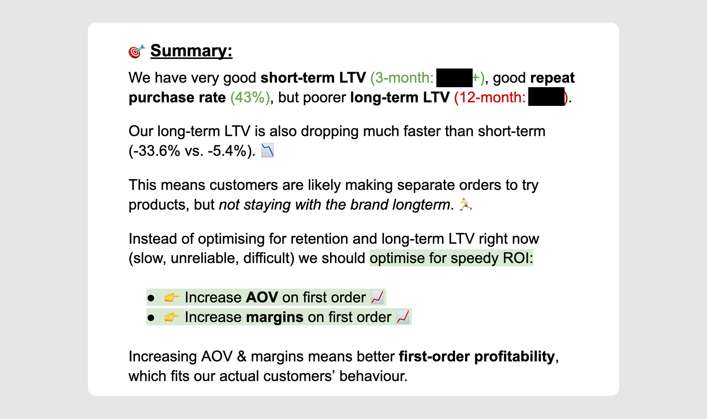

CVR hovered around 1-2% - not unusual for DTC skincare or that catastrophic given our strong AOV - but focusing on improving CVR alone can be a trap for brands like this.

CVR is a ratio metric, and with recent SEO improvements spiking traffic, this number would inevitably fluctuate. More importantly, for a business with our margins and indeterminate CPA numbers (we inherited a shaky Google Ads account), maximising order value is a more reliable lever than chasing incremental CVR improvements.

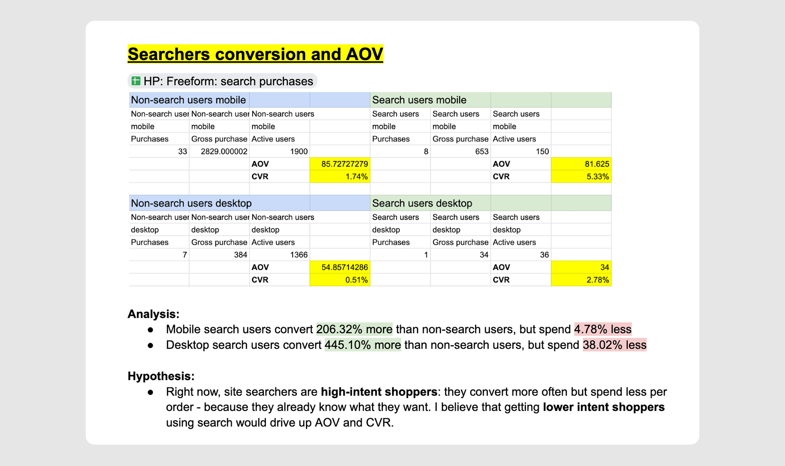

Traffic volume posed another challenge: we didn’t have the numbers to run traditional Frequentist A/B tests with statistical confidence. This meant we needed Bayesian testing.

***

## Strategy

Improving long-term retention was outside CRO’s scope (and frankly, difficult and unreliable in the best circumstances). So instead, I wanted to play to our strengths and optimise for how customers already bought. The strategy became front-loading value on first orders.

A complete rebuild was non-negotiable. The existing codebase made testing nearly impossible, and continuing to patch it would only compound our technical debt. Instead, I chose Dawn as our base theme for its development speed - super important when you’re a solo developer on a replatforming project.

<!-- I also had to pick a Bayesian testing platform that wouldn’t break the budget (harder than it sounds). I landed on PostHog. It offered the flexibility we wanted at a reasonable price point.

Knowing we’d be running feature flag experiments from day one, I structured the build to keep code isolated - avoiding Dawn’s temptation to dump everything into shared JS/CSS files and instead maintaining component-level separation.

Our product margins revealed an immediate opportunity: high-margin items were being undersold while low-margin bundles dominated. The existing bundle strategy prioritised products that moved volume but didn’t maximise profit per transaction. This was low-hanging fruit we could address through better merchandising and strategic upselling. -->

***

## UX Management & Feature Research

I worked closely with our UX designer, walking him through conversion-focused thinking. We discussed how different UI patterns influence purchase psychology - understanding when to introduce friction versus when to reduce it, how progressive disclosure affects information processing, and where to position trust signals throughout the funnel.

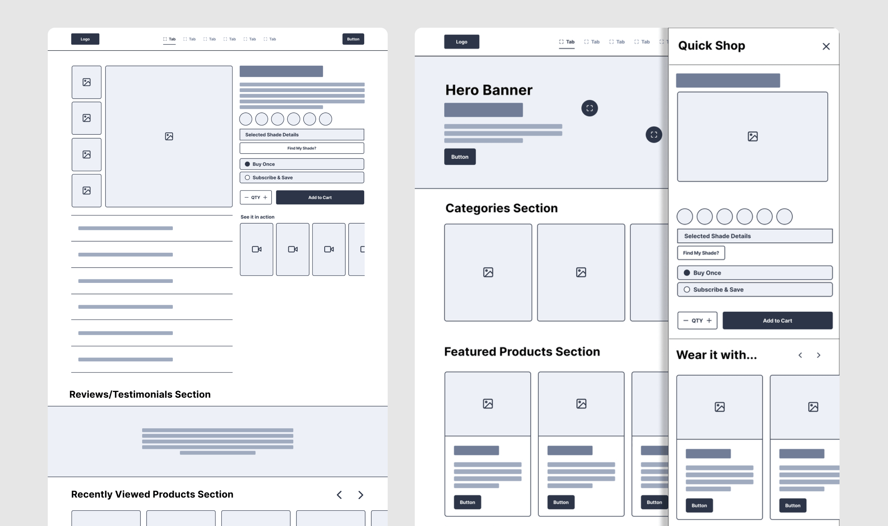

Selling premium products meant we had to move more carefully, and I was cautious to avoid drowning the store in conversion signals that could hurt the brand (premium customers don’t care about discount percentages, they want “systems” and “gifts”).

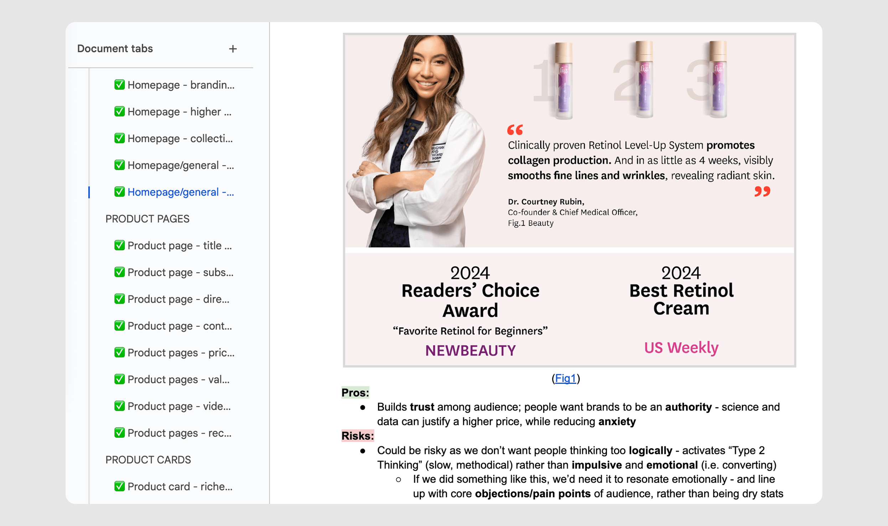

I also ran a competitive feature audit, analysing how other premium skincare brands structured their PDPs, cross-sells, and educational content.

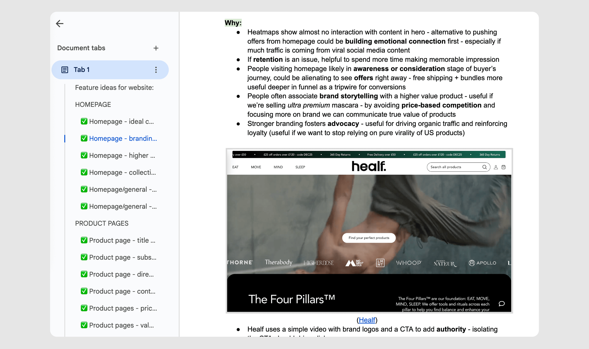

Each feature was evaluated against our AOV strategy, determining which patterns would translate to our customer base and product catalogue.

***

## Technical Implementation

The rebuild centred on Dawn with a custom build process: NPM for package management, Tailwind for utility-first styling, and custom build scripts in package.json that integrated cleanly with Shopify CLI.

```js
"scripts": {
    "pull-production": "dotenv -- bash -c 'shopify theme pull --store $STORE --theme=$PRODUCTION_THEME'",
    "pull-development": "dotenv -- bash -c 'shopify theme pull --store $STORE --theme=$DEVELOPMENT_THEME_ID'",
    "push-development": "dotenv -- bash -c 'shopify theme push --store $STORE --theme=$DEVELOPMENT_THEME_ID'",
    "pull-development-settings": "dotenv -- bash -c 'shopify theme pull --only=*.json --store $STORE --theme=$DEVELOPMENT_THEME_ID'",
    "start-tailwind": "npx tailwindcss -i ./src/tailwindinput.css -o ./assets/tailwind.css --watch",
    "purge-tailwind": "NODE_ENV=production npx tailwindcss -i ./src/tailwindinput.css -o ./assets/tailwind.css",
    "start-shopify": "dotenv -- bash -c 'shopify theme dev --theme=$DEVELOPMENT_THEME_ID'",
    "dev": "npm run pull-development-settings && npx concurrently \"npm run start-tailwind\" \"npm run start-shopify\"",
    "dev-alone": "npx concurrently \"npm run start-tailwind\" \"npm run start-shopify\""
  },
```

This setup dramatically improved development velocity compared to working with Dawn’s defaults, which can feel restrictive when you’re preparing for rapid test iteration.

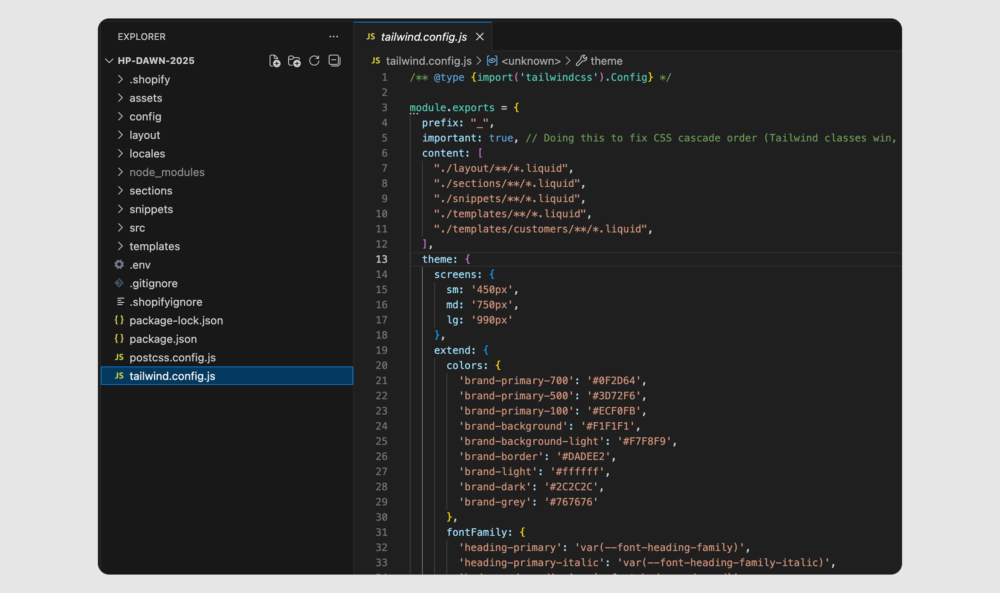

Everything was built modularly - reusable sections and snippets that could be recombined without duplicating code. Ironically, Shopify launched the Horizon theme exactly one week into development, introducing nested blocks and other features which would’ve been useful, but which I couldn’t leverage without starting over.

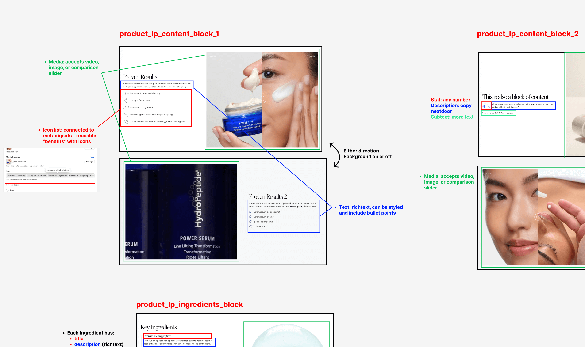

I set up a complex metaobject system for PDP content management, which required careful coordination with the content team. Once metaobject schemas are deployed and tightly bound to frontend code, changing them later can be painful!


The hardest thing to build was the navigation menu. Our UX designers had really pushed things far, so I had to wire up a complex metaobject system for menus too.

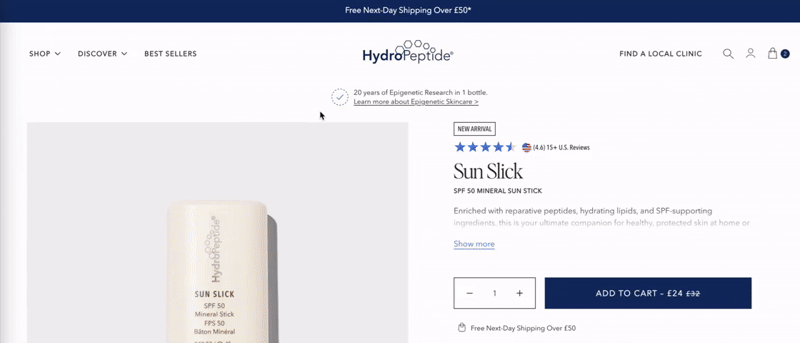

***

## Initial Results

Post-launch showed promising lifts in both CVR and AOV. There was a brief dip immediately following launch - a textbook primacy effect as returning customers adjusted to the new interface - but numbers stabilised and established a new baseline.


The data confirmed what I’d suspected: we were a first-order-driven business. Retention issues wouldn’t be solved by a theme update. This validated my decision to focus experimentation on front-end AOV and CVR optimisation rather than chasing long-term behavioural change.

***

## Experimentation Framework

I configured PostHog’s feature flags as our testing infrastructure. Beyond the generous MTU limits, PostHog’s architecture allowed us to run complex experiments without worrying about code conflicts.

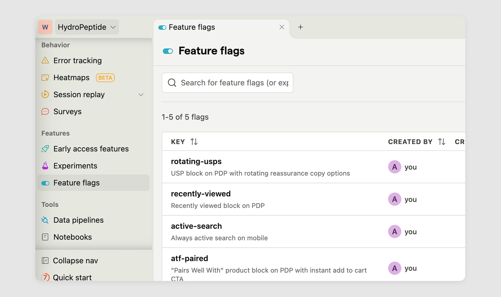

Each test lived in a self-contained file that could be toggled on or off without affecting the broader codebase - critical for maintaining site stability while running concurrent experiments.

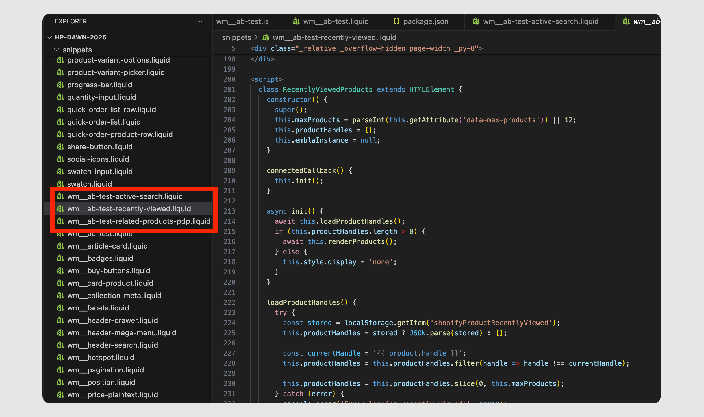

To get team buy-in, I carefully documented the process - to make sure everyone could understand and we didn’t accidentally overwrite tests.

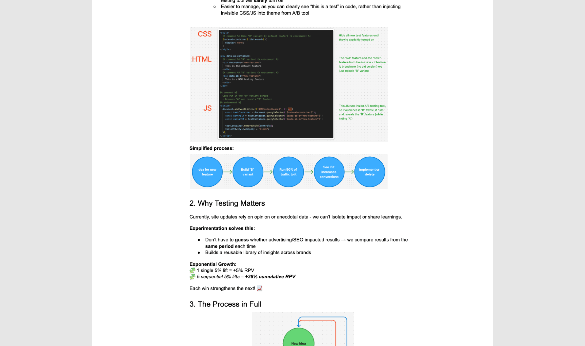

### <mark>Experiment 1:</mark> Peptide Education Pills

Our CMO pitched this first test based on customer support questions. The idea was highlighting the unique chemistry of each product. I suggested we use progressive disclosure to hide this information until needed.

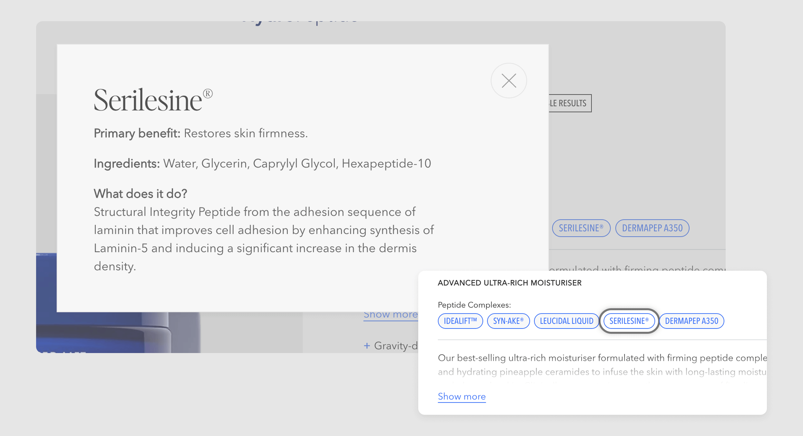

Heatmap analysis and session recordings showed users clicking around PDPs hunting for information, particularly around peptide ingredients - one of our best-performing SEO and paid search keywords.

```js
if (posthog.getFeatureFlag('peptide-pills')) handlePeptidePills();
function handlePeptidePills() {
  const test = document.querySelector('[data-abtest="peptide-pills"]');
  if (!test) return;
  const testElement = test.querySelector('[data-abtest-var="b"]');
  if (!testElement) return;

  testElement.style.display = "block";
}
```

We built educational "pills" that surfaced peptide information directly on product pages, reducing the need for users to hunt through descriptions or navigate away. The test aimed to reduce uncertainty at the critical moment before ATC.

### <mark>Experiment 2:</mark> One-Click Add-On Carousel

With AOV identified as our strongest lever, we added a product carousel just below the primary CTA featuring one-click upsells. I built this using Shopify’s native recommendations Liquid object, which intelligently suggests low-cost complementary products.

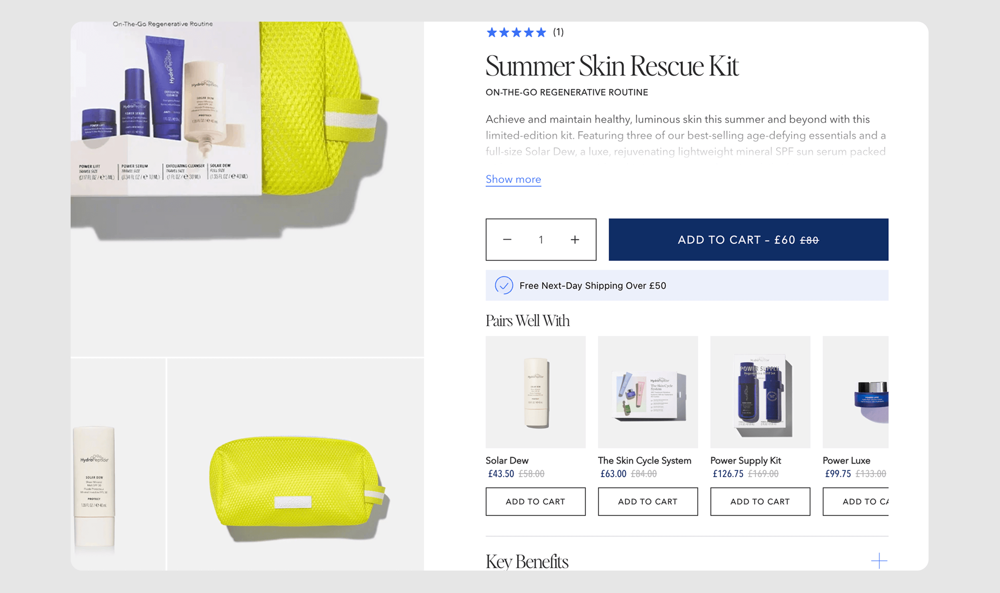

```js
if (posthog.getFeatureFlag('recently-viewed')  == 'test') handleRecentlyViewed();
function handleRecentlyViewed() {
  const test = document.querySelector('[data-abtest="recently-viewed"]');
  if (!test) return;
  const testElement = test.querySelector('[data-abtest-var="b"]');
  if (!testElement) return;

  testElement.style.display = "block";
}
```

Beyond the direct AOV impact, this pattern encouraged exploration - users could click through to learn about add-ons without losing their place in the purchase flow. The friction reduction was deliberate: make it trivially easy to increase basket size.

### <mark>Experiment 3:</mark> Persistent Mobile Search

Our analytics revealed an interesting pattern: search users converted at higher rates but had similar AOVs to non-search users.

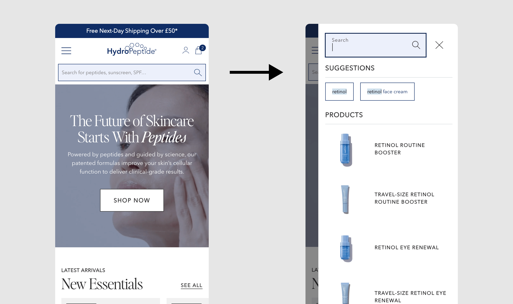

The hypothesis: only high-intent buyers were finding and using search, meaning we were missing opportunities with browsers who didn’t think to search.

```js
if (posthog.getFeatureFlag('active-search')  == 'test') handleActiveSearchTest();
function handleActiveSearchTest() {
  document.querySelector('header').classList.add('ab-test-active-search');
}
```

(Note: this test was a little more involved, so I had to use CSS classes to control multiple elements at once - doing this at the `<header>` level ended up making the most sense)

We implemented an always-visible search bar on mobile with contextual placeholder text suggesting search terms. If we could shift browsing behaviour toward search, we should see both CVR and AOV improvements as more users accessed our full catalogue efficiently.

### <mark>Experiment 4:</mark> Recently Viewed Section

I built a recently viewed module for PDPs, designed so we could deploy it across other page types if the test proved successful.

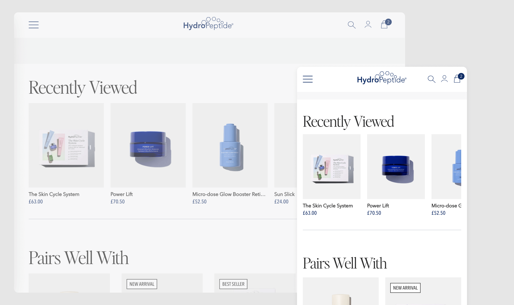

The data showed users who viewed more products converted better and spent more - not surprising, but it suggested navigability was a key conversion driver.

Very surprisingly, Shopify seems to have no native “recently viewed” logic (while having a product recommendations LIQUID object), so I had to build this using cookies.


```js
if (posthog.getFeatureFlag('recently-viewed')  == 'test') handleRecentlyViewed();
function handleRecentlyViewed() {
  const test = document.querySelector('[data-abtest="recently-viewed"]');
  if (!test) return;
  const testElement = test.querySelector('[data-abtest-var="b"]');
  if (!testElement) return;

  testElement.style.display = "block";
}
```

By reducing the friction of backtracking to previously viewed items, we hypothesised we could increase both conversion likelihood and basket size for users deep in product research.

***

## Key Learnings

This project was the first time I’d executed a full rebuild and immediately transitioned into continuous experimentation. A lot of companies stop after a relaunch, considering the work “done”. I pushed hard for ongoing optimisation and created a testing roadmap before the paint was dry on the new theme.

The results validated this approach: the initial post-launch lift was solid, but consistent A/B testing turned that improvement into sustained growth. You can’t optimise what you can’t measure, and you can’t measure what you can’t test - having the infrastructure in place from day one was the difference between a successful relaunch and a genuinely transformative project.

