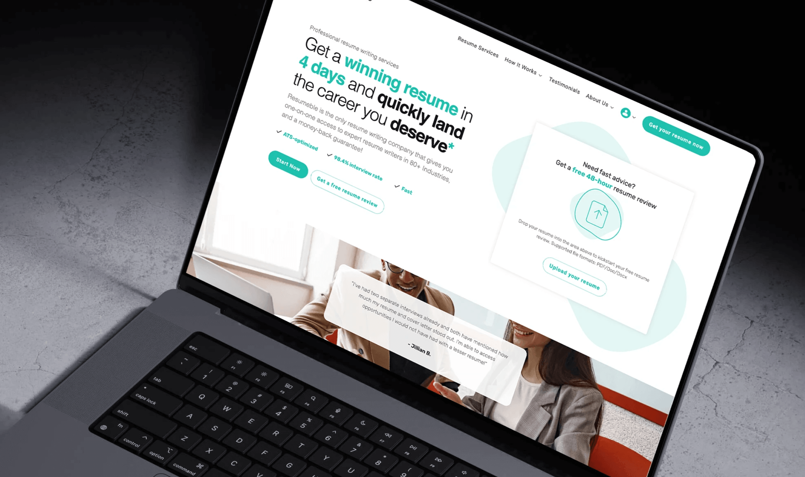
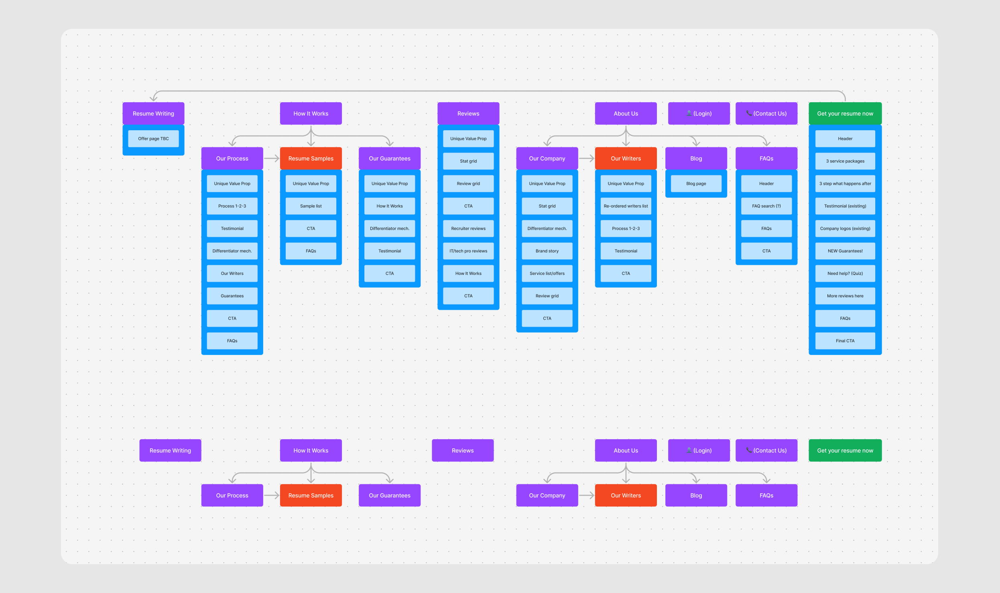
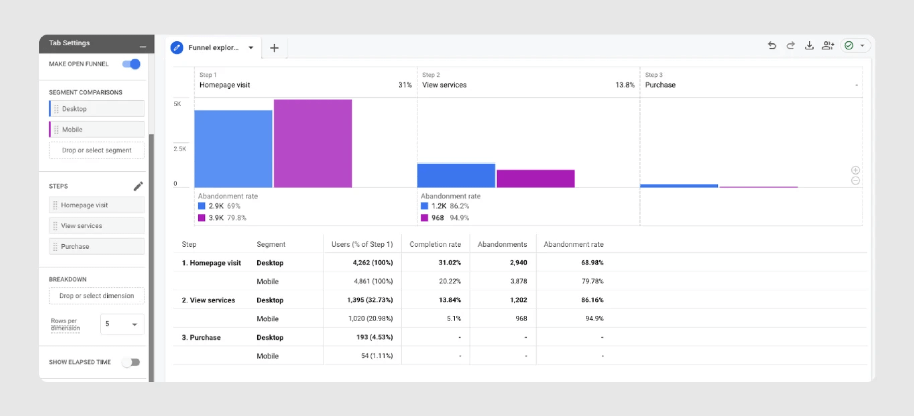
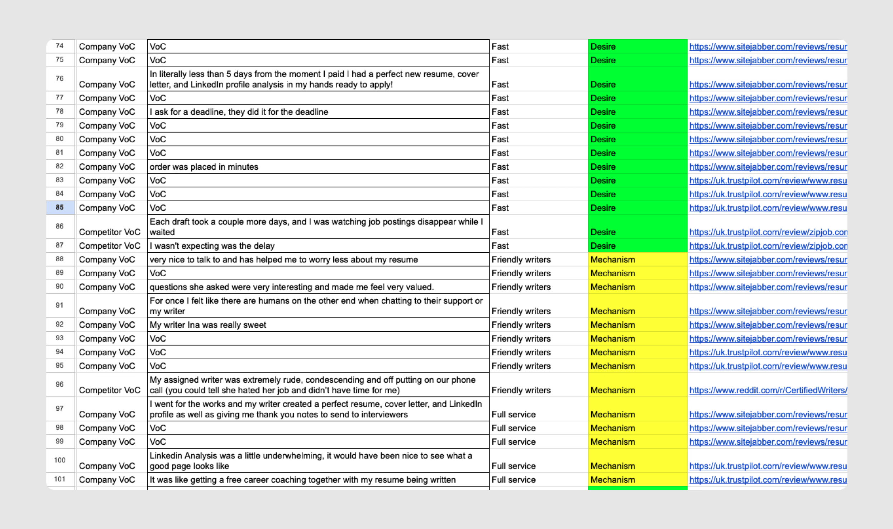
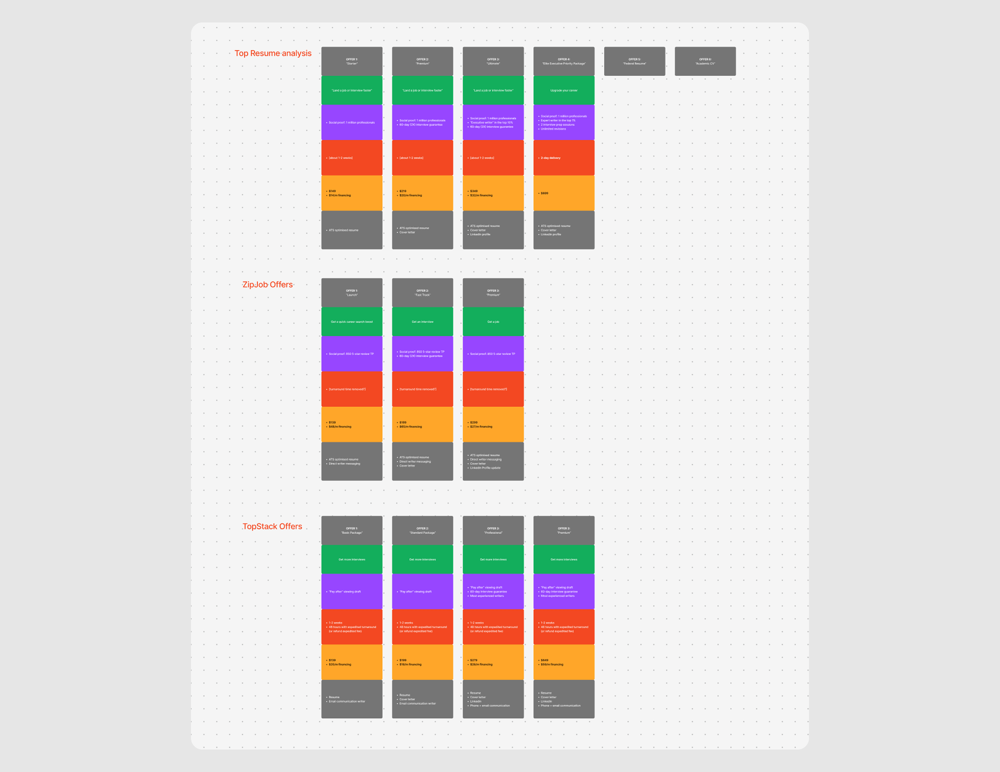
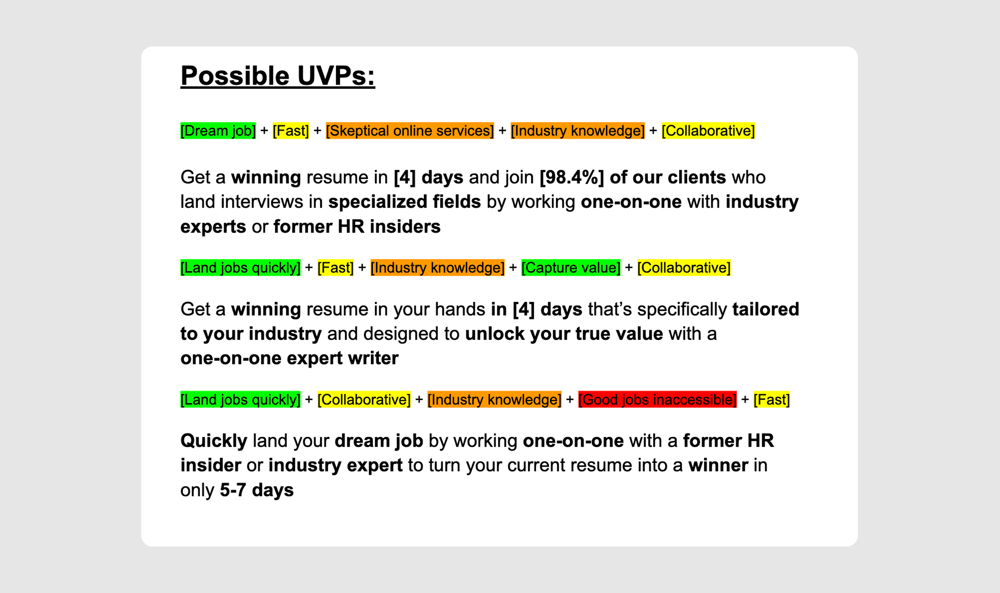
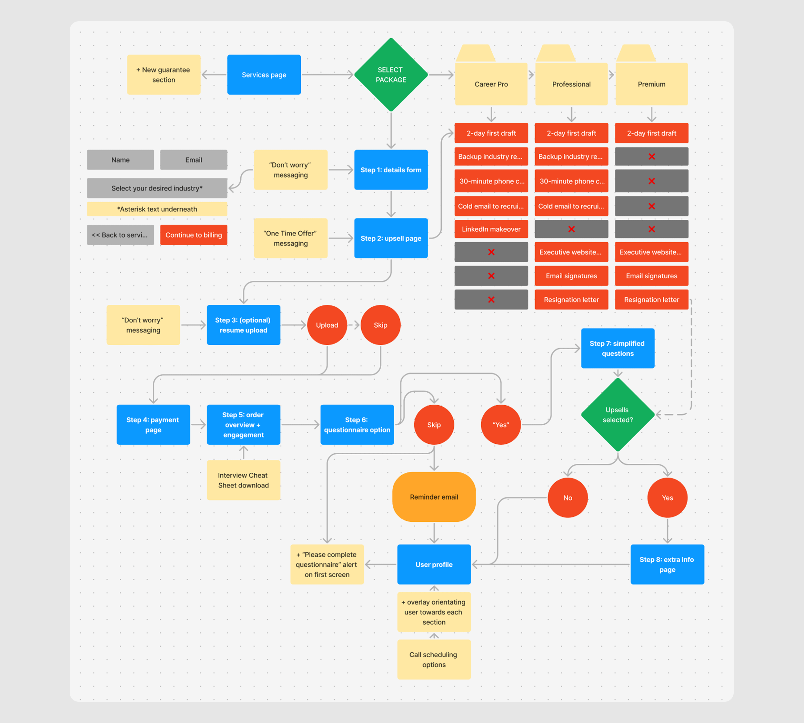
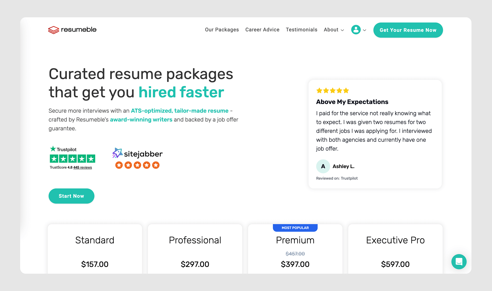
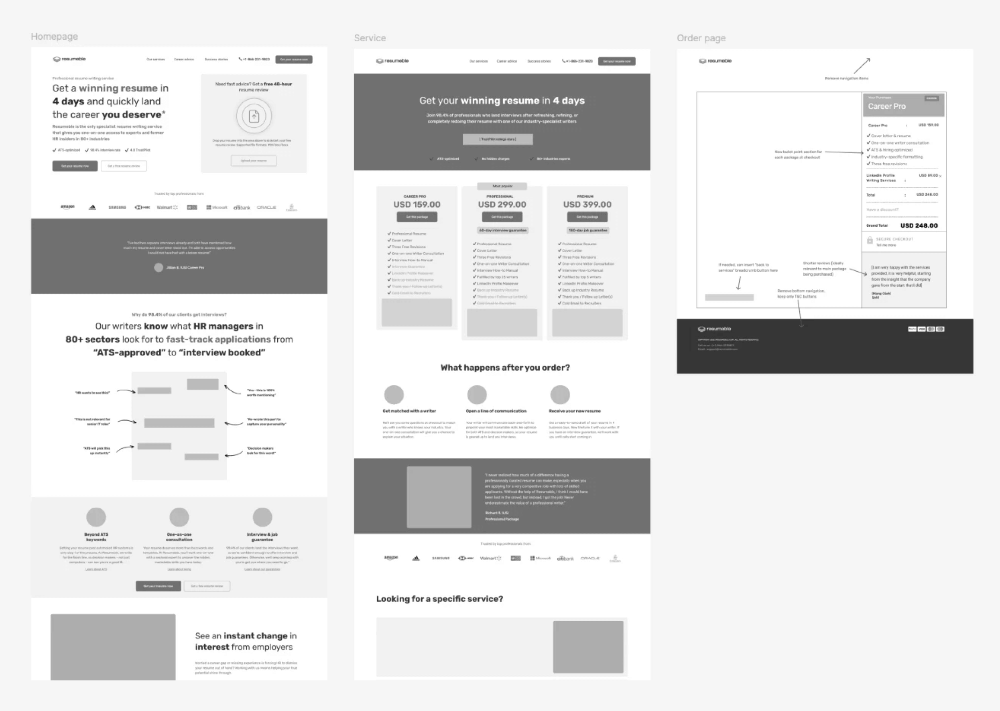
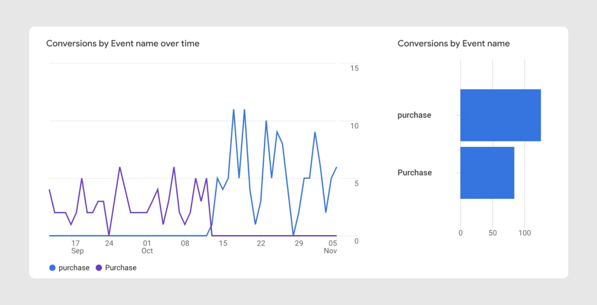

[Resumable](https://www.resumeble.com/) is an ATS-compliant resume writing service. I joined them as a CRO consultant back in 2023 and helped fix friction points in their user journey - creating wireframes, messaging, and new offers.

Within just four weeks of relaunching, <mark>CVR increased 108%</mark>, while amazingly <mark>mobile conversions jumped 340%</mark>.

## Business Context

Resumeble had a very common issue: their SEO worked to bring in traffic, but visitors then weren’t converting.

This was a shame because - compared to their competitors - they had absolutely glowing reviews… _(too many businesses in this space have pages of complaints on Better Business Bureau!)_

At the time, overall CVR sat at just 2.1%, well below the industry benchmark of 3-5%. Mobile was even worse - while desktop users converted at 4.4%, mobile users were converting at only 1.0%.

Years of SEO focus had resulted in a sprawling site with 40+ pages, creating a cluttered experience that buried the company’s key value proposition.

The business impact was clear: Resumeble was spending heavily on traffic acquisition but failing to convert qualified visitors, resulting in an unsustainable CPA and losing revenue to competitors with better-optimised funnels (not better businesses).

## Problem & Analytics

I began by diving into Google Analytics 4 to understand user behavior patterns. The pricing page jumped out as the biggest problem area: mobile users spent an average of just 12 seconds on this critical page before leaving.

Microsoft Clarity session recordings revealed usability issues. On mobile devices, 58% of users never scrolled below the fold, missing the primary CTAs entirely. Users were frantically clicking on non-clickable elements, and the pricing page required excessive scrolling to compare different tiers.

To learn more, I did sentiment analysis on over 200 testimonials to understand what satisfied customers valued most: 78% mentioned fast turnaround time, 67% highlighted industry-specific expertise, and 54% talked about success in landing interviews.

This was fascinating because Resumeble delivered completed resumes in just four days - one of the fastest in the industry - but this wasn’t mentioned anywhere above the fold. The company was sitting on a major competitive advantage and failing to communicate it.

My competitive analysis of TopResume, ZipJob, and TopStack Resume revealed a consistent pattern: all used a three-tier pricing model (versus Resumeble’s five), kept pricing pages concise (under 1,000 words compared to Resumeble’s 3,000), and heavily featured guarantees above the fold.

## Hypothesis Development

Using the ICE framework to prioritize hypotheses, I identified four high-impact opportunities:

<mark>Value Proposition Clarity:</mark> I hypothesized that leading with "Get a winning resume in 4 days" would significantly increase engagement by directly addressing customers’ top priority. This scored high because it aligned perfectly with what 71% of users said they valued most.

<mark>Pricing Simplification:</mark> Reducing from five packages to three would decrease decision paralysis. The data showed users weren’t spending enough time on the pricing page to evaluate five options properly.

<mark>Mobile optimisation:</mark> With mobile converting at 1.0% versus desktop’s 4.4%, implementing progressive disclosure through accordions would reduce cognitive overload. I projected we could increase mobile engagement 2-3x (which data suggested would translate to CVR).

<mark>Social Proof Positioning:</mark> Moving outcome-focused testimonials above the fold would increase trust signals early in the user journey and reduce bounce rate by 10-15%.

## Implementation Strategy

Given traffic volume constraints, I recommended a structured rollout we could measure through before-and-after analysis, then iterate on.

Initially, we'd make foundational changes: the new “Get a winning resume in 4 days” value proposition and homepage additions, simplified navigation from 40+ pages to 12 core pages, consolidated five pricing tiers into three clear packages, and added a sticky mobile CTA for the underutilized “Free Resume Review” service.

Then we'd build out the new pricing page. I restructured it to lead with value and outcomes rather than features, implemented accordion-style design for mobile, added trust indicators above the fold, and used "Most Popular" labels to create clear decision anchors.

Post-launch, we addressed conversion funnel friction. Session recordings showed users abandoning when asked for extensive information upfront, so we implemented progressive onboarding - collecting minimal information initially and moving complex questions post-purchase.

Throughout this process, I set up comprehensive tracking for CVR, add-to-cart rate, and engagement rate by device.

## Results

Four weeks post-launch, the results exceeded projections. Overall conversion rate jumped from 2.1% to 4.4% - a 108% increase. Revenue per visitor increased 92%. Bounce rate decreased 23%.

The most dramatic improvements came from mobile. Mobile conversion rate skyrocketed 340%, rising from 1.0% to 4.4% - reaching parity with desktop. Mobile abandonment on the pricing page dropped from 95% to 65%. Mobile now accounted for 51% of all conversions versus 18% previously.

Target personas showed even stronger results: IT professionals converted at 156% higher rates. The free resume review service hovered around the same, creating a robust lead nurture funnel.

## Key Takeaways

This project reinforced several critical CRO principles:

First, quantitative data beats assumptions. The stakeholder believed the problem was usability, but analytics revealed it was actually content structure and messaging clarity. Second, clarity beats persuasion - reducing options and friction improved metrics instantly. Finally, message-market fit matters. Aligning value propositions with actual customer language from testimonials and surveys dramatically improved engagement.

The 108% conversion lift translated to substantial monthly revenue growth. Most importantly, the changes created a foundation for sustainable, data-driven growth that Resumeble can continue leveraging long after our engagement ended.

